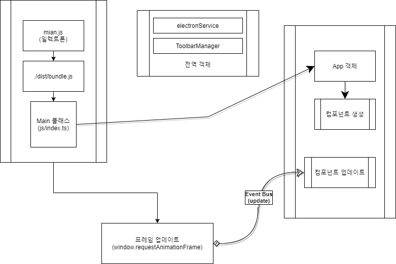
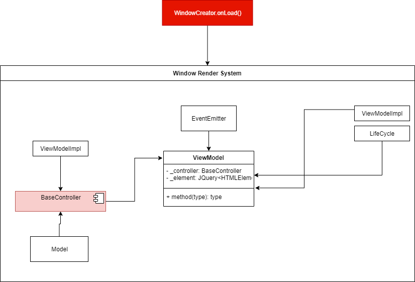
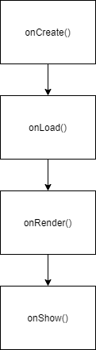

# Introduction

This tool allows you to create a multidimensional tilemap


# Environment

|         Platform Type         |    Status     |
| :---------------------------: | :-----------: |
|           Electron            | Stable (100%) |
| Chrome 85.0.4183.121 (64 Bit) | UnStable (0%) |
|     Firebox 79.0 (64 Bit)     | UnStable (0%) |

# How to setup

In case of platform such as `OSX`, try these steps. First up, you must install node in your system.

```sh
brew install node
node -v
cd ~/Documents
git clone https://github.com/biud436/InitialEditor.git
cd InitialEidtor
sudo npm install -D
```

In case of platform such as `Windows 10`, try to download the Node.js LTS version in your system manually. and next, if you exist the program called `git` in environment variable named `PATH` of your system, you must just call the command such as `git clone https://github.com/biud436/InitialEditor.git` in desired directory. and next try to below step.

```bat
git clone https://github.com/biud436/InitialEditor.git
cd InitialEidtor
npm install -D
```

# How to start on Windows 10

It is pretty easy. Open the Visual Studio Code and press key called `F5` on platform such as Windows 10. if you can't start the program, you must see the previous step.

# How to start on Mac OSX (Apple Silicon M1)

you have to run the shell script file such as `build.sh` and execute the command such as `npm run start`

```sh
sudo chmod +x ./build.sh
./build.sh
sudo npm run start
```

# Life Time

This documentation named 'Life Time' can't be translated yet in English.



This tool includes an event emitter on all sub windows. The window is splitted `Controller` and `View` and `Model`. and the Model has a data only and passed to as `Controller`.





# License

This tool is under the MIT License.

-   jQuery - MIT License.
-   jQuery UI - MIT License.
-   pixi.js - MIT License.
-   prefixfree.min.js - MIT License.
-   Electron - MIT Liccense.

---

But some icon and javascript and stylesheets and images included at this tool have their own licenses.

-   Font Awesome Free - https://fontawesome.com/license/free
-   FSM Tile (2k_town05.png) - http://refmap-l.blog.jp/archives/8632768.html
-   FSM Tile (2k_town05-01.png) - http://refmap-l.blog.jp/archives/8632768.html
-   Tuxemon Tileset - https://opengameart.org/content/tuxemon-tileset
