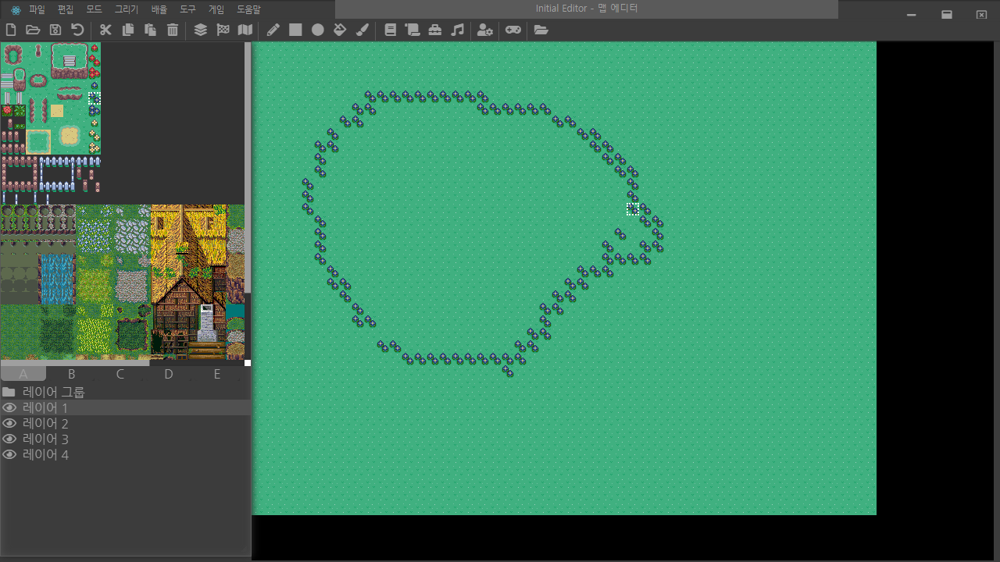

# Introduction

This project allows you to edit multi dimensional tile map on my own game engine. it is worked fine on any platforms such as Linux Desktop, OSX, Windows and so on.



# Environment

|         Platform Type         |    Status     |
| :---------------------------: | :-----------: |
|           Electron            | Stable (100%) |
| Chrome 85.0.4183.121 (64 Bit) | UnStable (0%) |
|     Firebox 79.0 (64 Bit)     | UnStable (0%) |

# How to setup

In case of platform such as `OSX`, try these steps. First up, you must install node in your system.

```sh
brew install node
node -v
cd ~/Documents
git clone https://github.com/biud436/InitialEditor.git
cd InitialEidtor
sudo yarn install -D
```

In case of platform such as `Windows 10`, try to download the Node.js LTS version in your system manually. and next, if you exist the program called `git` in environment variable named `PATH` of your system, you must just call the command such as `git clone https://github.com/biud436/InitialEditor.git` in desired directory. and next try to below step.

```bat
git clone https://github.com/biud436/InitialEditor.git
cd InitialEidtor
yarn install
```

# How to start on Windows 10

It is pretty easy. Open the Visual Studio Code and press key called `F5` on platform such as Windows 10. if you can't start the program, you must see the previous step.

# How to start on Mac OSX (Apple Silicon M1)

you have to run the shell script file such as `build.sh` and execute the command such as `npm run start` or `fn + F5`

```sh
sudo chmod +x ./build.sh
yarn dev
```

# How to upstream from remote github repository

To upstream from the remote repository, you must call below command.

```bash
git remote add upstream https://github.com/biud436/InitialEditor.git
git fetch upstream
git checkout electron
git merge upstream/electron
```

# License

This tool is under the MIT License.

---

But some icon and javascript and stylesheets and images included at this tool have their own licenses.

-   Font Awesome Free - https://fontawesome.com/license/free
-   FSM Tile (2k_town05.png) - http://refmap-l.blog.jp/archives/8632768.html
-   FSM Tile (2k_town05-01.png) - http://refmap-l.blog.jp/archives/8632768.html
-   Tuxemon Tileset - https://opengameart.org/content/tuxemon-tileset
