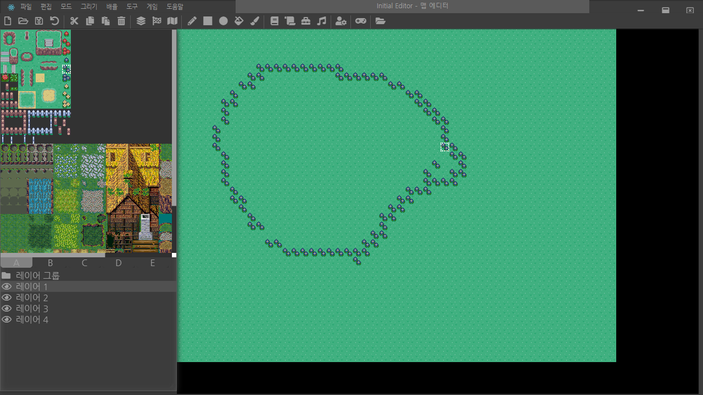

<div align="center">


</div>

# Introduction

This project allows you to edit multi dimensional tile map on my own game engine. it is worked fine on any platforms such as Linux Desktop, OSX, Windows and so on.

## Tilemap



## Child Window


## How to start (New way)

you have to run the following command in the terminal.

```sh
yarn build
yarn dev
```

## How to upstream from remote github repository

To upstream from the remote repository, you must call below command.

```bash
git remote add upstream https://github.com/biud436/InitialEditor.git
git fetch upstream
git checkout main
git merge upstream/main
```

# License

This tool is under the MIT License.

---

But some icon and javascript and stylesheets and images included at this tool have their own licenses.

- Font Awesome Free - https://fontawesome.com/license/free
- FSM Tile (2k_town05.png) - http://refmap-l.blog.jp/archives/8632768.html
- FSM Tile (2k_town05-01.png) - http://refmap-l.blog.jp/archives/8632768.html
- Tuxemon Tileset - https://opengameart.org/content/tuxemon-tileset
