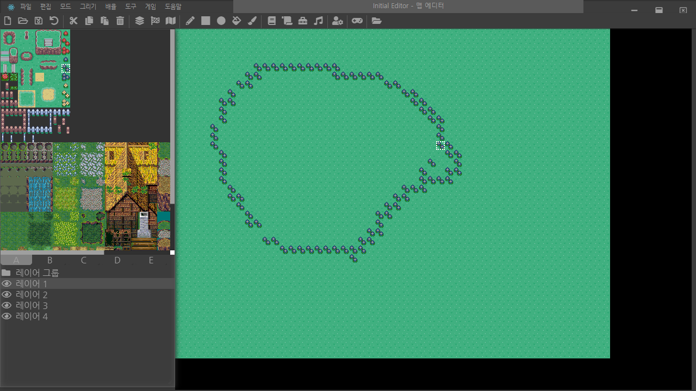

<div align="center">


</div>

# Introduction

This project allows you to edit multi dimensional tile map on my own game engine. it is worked fine on any platforms such as Linux Desktop, OSX, Windows and so on.

## Tilemap



## Child Window


## How to start (New way)

you have to run the following command in the terminal.

```sh
yarn build
yarn dev
```

## Working with an Initial2D project (bridge server)

The editor is a plain web app, so it reaches your local game project through a small
bridge server that ships with the [Initial2D](https://github.com/biud436/Initial2D) engine
(`tools/bridge/server.js`, Node 20+, no dependencies). The bridge exposes `scripts/` and
`resources/` of the game project over `http://127.0.0.1:5960` and can push scripts to the
running game (hot reload).

```sh
# in the Initial2D repository
INITIAL2D_HMR=1 ./build/Initial2D      # run the game with hot reload enabled
node tools/bridge/server.js            # serve this repository as the project (127.0.0.1:5960)
node tools/bridge/server.js --project ~/mygame

# in this repository
yarn build && yarn dev                 # open http://localhost:5173
```

- **Tools → Script Editor** lists `scripts/**/*.lua` from the project. Open a file, edit it, and
  press **Ctrl+S / Cmd+S** to save. With "저장 시 게임 리로드" checked (default) the bridge pushes
  the scripts to the running game right after each save. Files changed by other editors are
  reloaded automatically (or flagged when you have unsaved edits).
- The bridge URL can be changed with `localStorage['initial-editor.bridge-url']`.

## How to upstream from remote github repository

To upstream from the remote repository, you must call below command.

```bash
git remote add upstream https://github.com/biud436/InitialEditor.git
git fetch upstream
git checkout main
git merge upstream/main
```

# License

This tool is under the MIT License.

---

But some icon and javascript and stylesheets and images included at this tool have their own licenses.

- Font Awesome Free - https://fontawesome.com/license/free
- FSM Tile (2k_town05.png) - http://refmap-l.blog.jp/archives/8632768.html
- FSM Tile (2k_town05-01.png) - http://refmap-l.blog.jp/archives/8632768.html
- Tuxemon Tileset - https://opengameart.org/content/tuxemon-tileset
