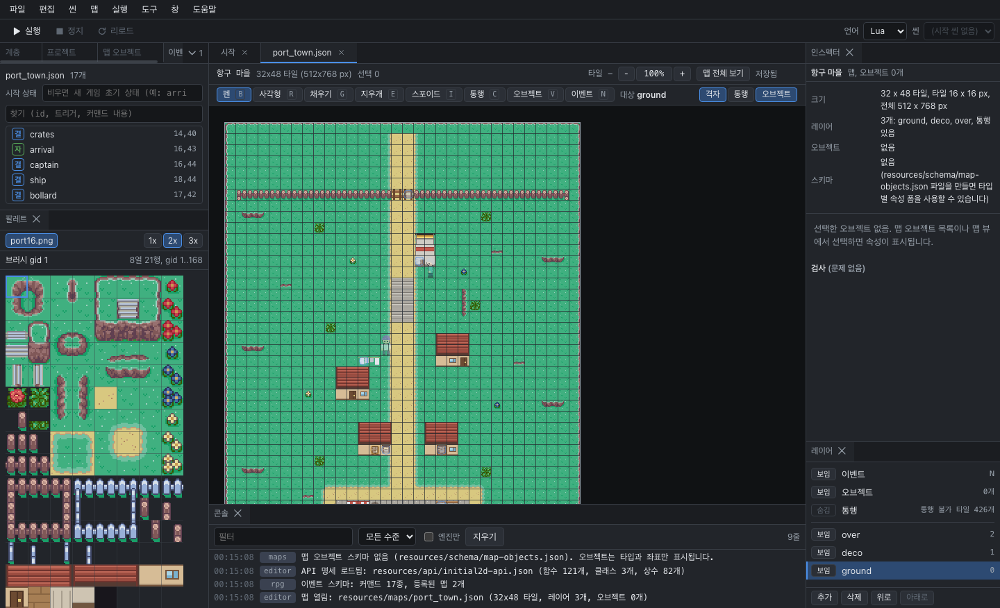

# InitialEditor 사용자 가이드

InitialEditor는 Initial2D 엔진용 게임 에디터입니다. 씬과 맵은 화면에서 직접 편집하고, 게임 로직은 Lua나 Ruby로 작성한 뒤 F5로 바로 실행해 봅니다. 플래피버드 같은 간단한 아케이드 게임도, 맵과 이벤트가 있는 RPG도 같은 에디터로 만들 수 있습니다.

## 처음 사용한다면

아래 세 문서를 순서대로 따라가면 30분 정도면 프로젝트를 만들어 실행하고, 오브젝트 하나를 직접 고쳐 볼 수 있습니다.

1. [설치와 첫 실행](install.md): 데스크톱 앱을 설치합니다. 설치 없이 브라우저에서 쓰는 웹판도 있습니다.
2. [첫 프로젝트](first-project.md): 템플릿으로 프로젝트를 만들고 실행해 봅니다.
3. [화면 구성](interface.md): 패널과 레이아웃, 설정이 어디에 있는지 알아봅니다.

## 하고 싶은 일로 찾기

| 하고 싶은 일 | 문서 |
|---|---|
| 화면에 오브젝트를 배치하고 속성 정하기 | [씬 편집](scenes.md) |
| 코드로 게임 로직 작성하기 | [스크립트 편집](scripts.md) |
| 실행해 보고 오류 찾기 | [게임 실행](running.md) |
| 타일맵을 칠하고 몬스터나 시작 지점 배치하기 | [맵 편집](maps.md) |
| NPC 대화나 맵 이동 같은 RPG 이벤트 만들기 | [RPG 이벤트](rpg-events.md) |
| 코드 대신 노드를 연결해서 동작 만들기 | [비주얼 스크립팅](visual-scripting.md) |

## 참고 자료

- [단축키](shortcuts.md)
- [문제 해결](troubleshooting.md): 게임이 실행되지 않거나 자동 완성이 나오지 않을 때
- [엔진 API 레퍼런스](https://github.com/biud436/Initial2D#lua-대응표): 스크립트에서 쓸 수 있는 함수 목록 (Lua, Ruby)

에디터에서는 **도움말 > 사용자 가이드**(F1)를 누르면 이 문서가 열립니다.
