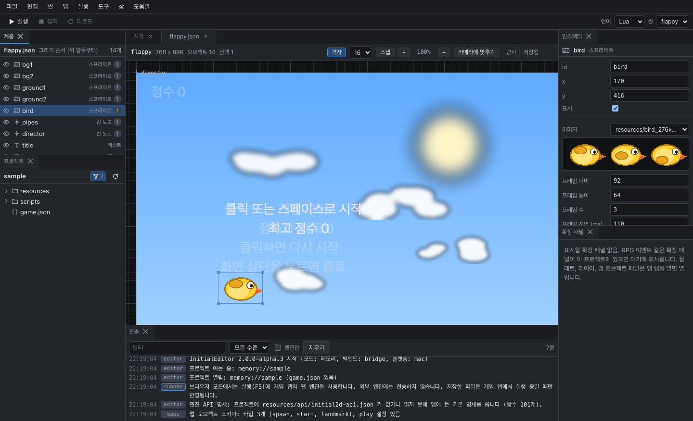

# 화면 구성

에디터 창은 메뉴, 도구 모음, 패널, 문서 영역, 상태 표시줄로 구성됩니다. 패널은 문서 영역 주위에 배치되는 도구 창이고, 문서 영역은 파일(씬, 맵, 스크립트, 그래프)과 게임 탭을 여는 곳입니다.

## 패널

| 기본 위치 | 패널 | 내용 |
|---|---|---|
| 왼쪽 위 | 계층 | 열린 씬의 오브젝트 목록 (그리는 순서) |
| 왼쪽 아래 | 프로젝트 | 프로젝트 폴더의 파일 목록. 두 번 클릭하면 파일이 열립니다 |
| 가운데 | 문서 영역 | 씬, 맵, 스크립트, 그래프, 게임 탭 |
| 가운데 아래 | 콘솔 | 게임 출력, 오류, 에디터 메시지 |
| 오른쪽 위 | 인스펙터 | 선택한 오브젝트의 속성 |
| 오른쪽 아래 | 확장 패널 | 확장 기능(RPG 이벤트 등)이 추가한 패널 목록 |

맵 파일을 열면 팔레트, 레이어, 맵 오브젝트 패널이 추가로 열립니다.

## 패널 배치와 레이아웃

- 패널 탭을 다른 위치로 드래그하면 패널이 그 위치로 이동합니다. 문서 탭도 같은 방법으로 화면을 분할할 수 있습니다.
- 닫은 패널은 **창** 메뉴에서 다시 엽니다.
- **창 > 레이아웃**은 미리 정의된 배치를 적용합니다.

| 레이아웃 | 포함된 패널 |
|---|---|
| 씬 | 계층, 프로젝트, 인스펙터, 확장 패널, 콘솔 (기본 배치) |
| 스크립트 | 프로젝트, 콘솔 |
| 타일맵 | 계층, 프로젝트, 맵 오브젝트, 팔레트, 인스펙터, 레이어, 콘솔. RPG 프로젝트에서는 이벤트 패널 포함 |

- **창 > 레이아웃 초기화**는 기본 배치로 되돌립니다.
- 패널 배치와 열린 탭은 프로젝트별로 `.initial-editor/` 폴더에 저장되고, 프로젝트를 다시 열 때 복원됩니다.

## 도구 모음

도구 모음에는 **실행**, **정지**, **리로드** 버튼과 실행 상태가 표시됩니다. 오른쪽의 언어 목록과 씬 목록은 각각 `game.json`의 `script`, `startScene` 값을 바꿉니다. 값을 바꾸면 `game.json`에 바로 저장됩니다.

## 상태 표시줄

창 아래쪽 상태 표시줄에 표시되는 항목은 다음과 같습니다.

- 프로젝트 경로
- 실행 환경 (데스크톱 앱, 브라우저 폴더, 메모리)
- 게임의 스크립트 언어
- 저장 상태 (저장하지 않은 문서 수)
- 실행에 사용할 엔진
- 언어 서버 상태 (해당 언어의 스크립트를 연 뒤 표시)
- 테마

## 콘솔

콘솔은 게임의 표준 출력(`print`), 엔진 로그, 에디터 메시지를 시간순으로 표시합니다.

- `파일:줄` 형식이 포함된 오류 줄은 링크입니다. 클릭하면 해당 파일의 해당 줄이 열립니다.
- 필터 입력란, 수준 목록(모든 수준, 디버그, 정보, 경고, 오류), **엔진만** 체크 상자로 표시할 줄을 거릅니다.
- **지우기**는 표시된 줄을 모두 지웁니다.

## 설정

**도구 > 설정**(Ctrl+,)에서 변경합니다. 설정은 프로젝트가 아니라 에디터에 저장됩니다.

| 항목 | 설명 |
|---|---|
| 테마 | 시스템 설정 사용, 다크, 라이트 |
| 실행 방식 | 프로세스(엔진 실행 파일, 별도 창) 또는 게임 탭(웹 엔진). [게임 실행](running.md) 참고 |
| 엔진 경로 | 프로세스 실행에 사용할 엔진 실행 파일. 비워 두면 자동으로 탐색합니다 |
| 저장 시 리로드 | 저장할 때 실행 중인 게임에 핫 리로드를 보냅니다 (기본값: 켜짐) |
| 에디터 폰트 크기, 탭 크기 | 스크립트 편집기의 글자 크기와 들여쓰기 너비 |
| 에디터 표시 | 자동 줄바꿈, 미니맵 |
| 언어 서버 | 스크립트에 언어 서버를 사용합니다 (기본값: 켜짐) |
| 진단 표시 | 표시 안 함, 구문 오류만, 규칙 전체(`.luarc.json`) |
| 엔진 저장소 | 안드로이드 스테이징에 사용할 엔진 소스 폴더 |

## 메뉴

| 메뉴 | 항목 |
|---|---|
| 파일 | 새 프로젝트, 프로젝트 열기, 최근 프로젝트, 새 스크립트, 새 그래프 컴포넌트, 저장, 모두 저장, 프로젝트 닫기 |
| 편집 | 되돌리기, 다시 실행, 잘라내기, 복사, 붙여넣기, 복제, 삭제, 찾기, 프로젝트에서 찾기 |
| 씬 | 새 씬, 오브젝트 추가, 시작 씬으로 지정, 격자 표시, 스냅, 줌 |
| 맵 | 새 맵, 크기 바꾸기, 오버레이, 이 맵에서 실행, 이벤트 도구 |
| 실행 | 실행, 정지, 다시 시작, 현재 씬부터 실행, 리로드, 언어, 엔진 경로, 안드로이드로 스테이징 |
| 도구 | 설정, 언어 서버 다시 시작 |
| 창 | 패널, 레이아웃, 레이아웃 초기화 |
| 도움말 | 사용자 가이드, 단축키, 엔진 API 레퍼런스, InitialEditor 정보 |

편집 메뉴의 잘라내기, 복사, 붙여넣기, 복제, 삭제는 현재 활성화된 탭의 내용에 적용됩니다. 씬 탭에서는 씬 오브젝트, 맵 탭에서는 맵 오브젝트, 그래프 탭에서는 노드, 스크립트 탭에서는 텍스트가 대상입니다.
