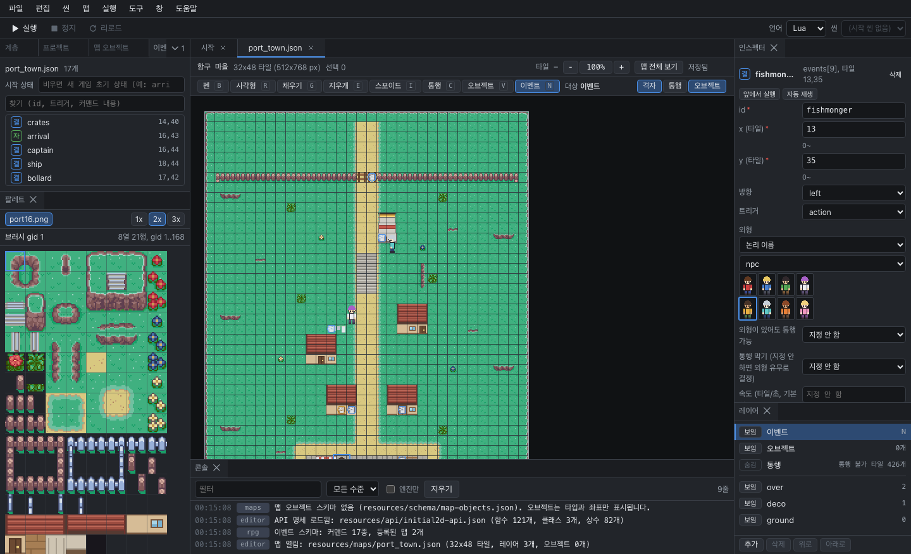

# RPG 이벤트

RPG 데모 템플릿으로 만든 프로젝트에서는 맵 위에 이벤트를 배치해서 NPC 대화, 보물 상자, 맵 이동 같은 것을 만들 수 있습니다. 이벤트는 맵 파일의 `events`에 저장되고, 게임의 RPG 레이어(`scripts/lua/rpg/`)가 실행합니다. RPG 레이어가 Lua로 작성되어 있어서 RPG 프로젝트는 Lua로만 만들 수 있습니다.

## 이벤트를 쓸 수 있는 맵

`resources/data/rpg-game.json`에 등록된 맵(데모에서는 항구 마을과 여관)을 열면, 레이어 패널 맨 위에 **이벤트** 레이어가 생깁니다. 등록되지 않은 맵에는 이 레이어 대신 안내 문구가 나옵니다. 새로 만든 맵에서 이벤트를 쓰고 싶다면 `rpg-game.json`의 맵 목록에 그 맵을 추가하세요.

## 이벤트 만들고 배치하기

1. **맵 > 이벤트 도구**(N)를 선택합니다.
2. 빈 칸을 두 번 클릭하면 그 자리에 새 이벤트가 생깁니다.
3. 오른쪽 인스펙터에서 속성과 커맨드를 편집합니다.

| 조작 | 결과 |
|---|---|
| 클릭 | 선택 (Shift나 Ctrl을 누르면 선택에 더하거나 뺌) |
| 빈 곳에서 드래그 | 여러 개를 한꺼번에 선택 |
| 이벤트를 드래그 | 칸 단위로 이동. 놓을 수 없는 칸이면 빨간색으로 미리 보여 주고 원래 자리로 돌아갑니다 |
| 방향키 | 한 칸 이동 |
| Delete | 삭제 |
| Enter | 커맨드 편집으로 이동 |
| Ctrl+C, Ctrl+V, Ctrl+D | 복사, 커서가 있는 칸에 붙여넣기, 복제 |

외형이 있는 이벤트는 캐릭터 그림으로 보이고, 외형이 없는 이벤트는 트리거의 첫 글자(말, 밟, 자, 병)로 표시됩니다.

## 이벤트 속성

| 속성 | 설명 |
|---|---|
| id | 이벤트 이름입니다. 이동 루트나 방향 전환 커맨드가 이 id로 이벤트를 가리킵니다. id를 바꾸면 같은 맵 안의 참조도 함께 바뀝니다 |
| x, y | 칸 위치 |
| 방향 | 처음에 바라보는 방향 |
| 트리거 | 언제 실행될지 (아래 표 참고) |
| 외형 | 캐릭터 그림입니다. 아래의 8칸짜리 목록에서 고릅니다 |
| 통행 가능, 통행 막기 | 플레이어가 이 이벤트를 지나갈 수 있는지 |
| 속도, 배회 | 움직이는 속도와 돌아다닐 범위. 배회 범위는 맵에서 가장자리를 드래그해 조절합니다 |

| 트리거 | 실행되는 때 | 쓰임새 |
|---|---|---|
| action (말) | 플레이어가 앞에서 결정 키를 눌렀을 때 | NPC 대화, 보물 상자 |
| touch (밟) | 플레이어가 그 칸에 올라섰을 때 | 문, 함정 |
| auto (자) | 맵에 들어오자마자 한 번 | 컷신 |
| parallel (병) | 맵에 있는 동안 계속 | 배경 연출 |

## 커맨드 편집

인스펙터 아래쪽의 커맨드 목록이 이벤트가 실제로 하는 일입니다. 위에서부터 차례대로 실행됩니다.

| 키 | 동작 |
|---|---|
| 위, 아래 | 줄 이동 |
| Enter | 커맨드 입력 폼 열기 |
| Insert | 커맨드 목록을 열어 새 커맨드 넣기 |
| Ctrl+위, Ctrl+아래 | 커맨드 순서 바꾸기 |
| Ctrl+C, Ctrl+V | 여러 줄 복사, 붙여넣기 |
| Delete | 커맨드 삭제 |
| Esc | 입력 폼을 닫고 목록으로 돌아가기 |

목록 위의 **위에 삽입**, **아래에 삽입** 버튼으로도 커맨드를 넣을 수 있습니다. Insert 키가 없는 Mac 키보드에서는 이 버튼을 쓰거나, 목록 맨 끝 줄에서 Enter를 누르세요.

쓸 수 있는 커맨드는 다음과 같습니다.

| 분류 | 커맨드 |
|---|---|
| 대화 | 대화, 선택지, 장소 이름 |
| 흐름 | 조건 분기, 기다리기, 메모 |
| 이동 | 맵 이동, 이동 루트, 방향 전환 |
| 상태 | 플래그, 변수, 아이템 얻기, 아이템 잃기 |
| 소리 | 효과음, 배경음 |
| 그 밖 | 씬 전환, 스크립트 |

조건 분기를 쓰면 가진 아이템 개수나 플래그 값에 따라 다른 커맨드를 실행할 수 있습니다. 데모에 나오는 대사도 대부분 플래그와 아이템에 따라 달라집니다.

### 맵 이동 위치 정하기

맵 이동 커맨드의 입력 폼 아래에는 **맵에서 선택**과 **대상 보기** 버튼이 있습니다.

- **맵에서 선택**: 이동할 맵이 열립니다. 도착할 타일을 클릭하면 원래 맵으로 돌아오면서 x, y가 채워집니다. 취소하려면 Esc를 누르세요.
- **대상 보기**: 이동할 맵을 열고, 지정한 칸을 화면 가운데에 보여 줍니다.

## 이벤트 패널

**창 > 이벤트**(타일맵 레이아웃에는 이미 들어 있습니다)를 열면 이 맵의 이벤트 목록이 나옵니다. id, 트리거, 대사로 검색할 수 있고, 오류와 경고가 몇 개인지도 보여 줍니다.

패널 위쪽 **시작 상태**에 플래그와 아이템을 적어 두면, 실행할 때 그 상태에서 게임이 시작됩니다. 예를 들어 `arrived,item:warehouse_key=1`이라고 적으면 `arrived` 플래그가 켜져 있고 창고 열쇠를 한 개 가진 상태로 시작합니다. 비워 두면 새 게임과 같습니다. 상태에 따라 대사가 달라지는 이벤트를 확인할 때 유용합니다.

## 바로 실행해서 확인하기

| 방법 | 결과 |
|---|---|
| 이 맵에서 실행 (Ctrl+F5) | 선택한 이벤트 앞, 아니면 커서나 화면 가운데에서 가장 가까운 설 수 있는 칸에서 시작 |
| 이 이벤트 앞에서 실행 | 이벤트를 바라보고 그 앞 칸에 선 채로 시작. 직접 말을 걸어 볼 수 있습니다 |
| 이 이벤트 자동 재생 | 플레이어가 알아서 말을 걸거나 밟고, 대화도 넘기고(선택지는 첫 번째 항목), 끝나면 게임을 닫습니다 |

**앞에서 실행**과 **자동 재생**은 인스펙터의 버튼, **맵** 메뉴, 이벤트 패널에서 항목을 오른쪽 클릭한 메뉴에 있습니다. parallel 이벤트는 끝나지 않기 때문에 자동 재생을 쓸 수 없습니다.

콘솔에는 플레이어 위치(`rpg:player:`), 실행된 이벤트(`rpg:event:`), 나온 대사(`rpg:message:`)가 찍히므로 무엇이 실행되었는지 확인할 수 있습니다.

## 저장할 때 오류 확인

다른 프로그램에서 맵 파일을 고치다가 엔진이 읽지 못하는 이벤트가 생기면, 저장하기 전에 그 목록을 보여 주고 저장할지 물어봅니다. 에디터 안에서 편집한 값으로는 이런 오류가 생기지 않습니다.
