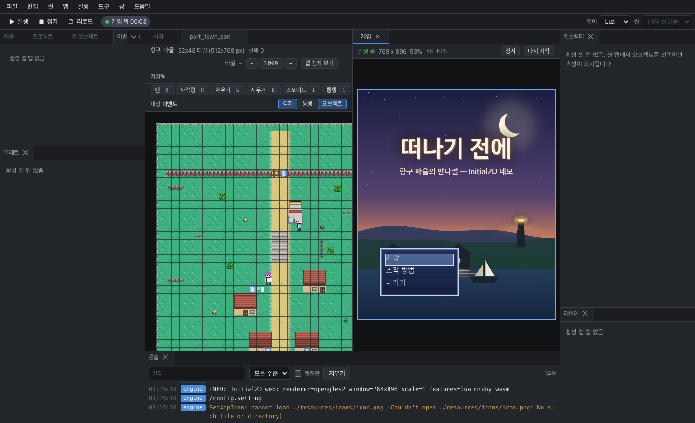

# 게임 실행



## 실행하고 멈추기

| 동작 | 단축키 |
|---|---|
| 실행 | F5 |
| 정지 | Shift+F5 |
| 현재 씬부터 실행 (맵 탭에서는 이 맵에서 실행) | Ctrl+F5 |
| 다시 시작 | 실행 > 다시 시작 |
| 리로드 (게임 창은 그대로 두고 스크립트만 다시 불러오기) | Ctrl+Shift+R |

저장하지 않은 파일이 있으면 실행하기 전에 물어봅니다. 게임은 디스크에 저장된 파일을 읽기 때문에, 저장해야 고친 내용이 보입니다. Enter를 누르면 모두 저장하고 실행합니다.

어떤 언어로 실행할지는 `game.json`의 `script`가 정합니다. 도구 모음의 언어 목록이나 **실행 > 언어**에서 바꿀 수 있습니다.

## 두 가지 실행 방식

**도구 > 설정**의 **실행 방식**에서 고릅니다.

| 방식 | 화면 | 특징 |
|---|---|---|
| 프로세스 (기본값) | 별도 창 | 엔진 실행 파일을 그대로 실행합니다. 배포할 게임과 똑같이 동작합니다 |
| 게임 탭 | 에디터 안의 탭 | 엔진의 웹 빌드를 에디터 안에서 실행합니다. 스크립트와 나란히 놓고 보기 편합니다 |

웹판과 Windows 판은 언제나 게임 탭에서 실행됩니다. 엔진 실행 파일을 찾지 못했을 때도 게임 탭으로 실행합니다.

### 게임 탭을 쓸 때

- 게임 탭은 처음에 문서 영역 오른쪽에 열립니다. 다른 곳으로 옮겨 두면 다음부터는 그 자리에 열립니다.
- 게임 화면을 클릭하면 키보드 입력이 게임으로 갑니다. 그래도 F5나 Shift+F5 같은 실행 단축키는 에디터가 받습니다.
- 브라우저 정책 때문에 처음에는 소리가 나지 않습니다. 위쪽의 **소리 켜기**를 누르거나 게임 화면을 한 번 클릭하세요.
- 위쪽에 실행 상태, 화면 크기와 배율, FPS가 표시됩니다.

## 저장하면 바로 적용 (핫 리로드)

게임을 실행하는 중에 스크립트, 씬, 맵을 저장하면 게임 창을 닫지 않고 바뀐 파일을 다시 불러옵니다. 이때 콘솔에 "핫 리로드"라는 줄이 남습니다. 스크립트를 처음부터 다시 불러오기 때문에 점수 같은 진행 상황은 처음으로 돌아갑니다.

이 기능을 끄려면 **도구 > 설정**에서 **저장 시 리로드**를 해제하세요.

## 콘솔과 오류

게임의 `print` 출력과 엔진 로그는 콘솔에 나옵니다. 스크립트에서 오류가 나면 이런 줄이 찍힙니다.

```
Lua error in update: ./scripts/lua/components/player.lua:12: attempt to index a nil value
```

파일 이름과 줄 번호 부분은 링크라서, 클릭하면 해당 스크립트의 그 줄로 바로 이동합니다. 그래프로 만든 컴포넌트에서 난 오류라면 그래프가 열리고, 그 줄을 만든 노드가 선택됩니다.

- 게임이 시작될 때나 `update`, `render`에서 오류가 나면 게임은 종료 코드 1로 끝납니다. 오류를 고친 뒤 F5로 다시 실행하세요.
- 게임 실행 중에 저장한 스크립트에 오류가 있으면, 게임 창은 닫히지 않고 스크립트만 멈춥니다. 고쳐서 다시 저장하면 이어서 실행됩니다.

## 엔진을 찾는 순서 (데스크톱 앱)

프로세스 방식으로 실행할 때는 엔진 실행 파일을 아래 순서로 찾습니다.

1. **도구 > 설정**의 **엔진 경로** (**실행 > 엔진 경로**에서도 지정할 수 있습니다)
2. 프로젝트의 `.initial-editor/engine` 파일에 적힌 경로
3. 프로젝트 안의 `build/Initial2D`
4. 앱에 들어 있는 엔진
5. 프로젝트 옆 폴더의 `../Initial2D/build/Initial2D`

2, 3, 5번처럼 프로젝트 쪽에서 가리키는 실행 파일은, 처음 한 번 경로를 보여 주고 실행해도 되는지 물어봅니다. 다른 사람에게 받은 프로젝트에 들어 있던 실행 파일이 확인 없이 실행되는 일을 막기 위해서입니다. 허용한 것은 **도구 > 설정**의 **찾은 엔진**에서 취소할 수 있습니다.

지금 어떤 엔진을 쓰고 있는지는 상태 바와 **도움말 > InitialEditor 정보**에서 확인할 수 있습니다.

## 안드로이드 기기에서 실행하기

**실행 > 안드로이드로 스테이징**을 선택하면 열려 있는 프로젝트를 엔진 저장소의 안드로이드 프로젝트로 복사합니다. APK를 빌드하거나 설치하지는 않고, 작업이 끝나면 이어서 입력할 명령을 콘솔에 알려 줍니다.

- 엔진 저장소(Initial2D 소스)와 bash, python3이 필요합니다. Windows에서는 Git for Windows에 들어 있는 bash가 필요합니다.
- 엔진 저장소 위치는 **도구 > 설정**의 **엔진 저장소**에서 정합니다. 비워 두면 알아서 찾습니다.
- 복사하기 전에 확인 창에서 파일 개수와 크기를 먼저 보여 줍니다.
