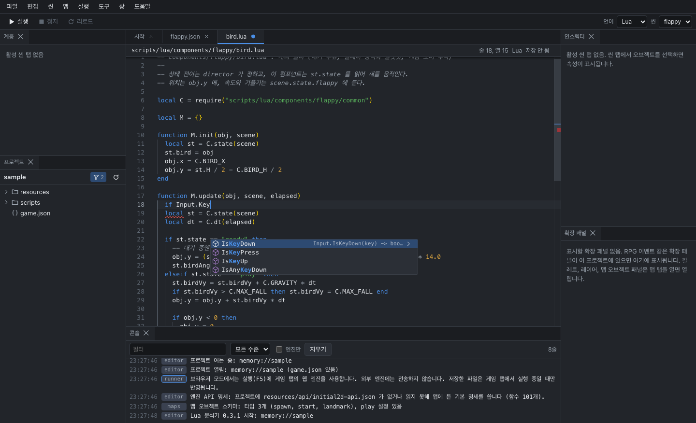

# 스크립트

스크립트는 게임 동작을 정의하는 Lua 또는 Ruby 파일입니다. 프로젝트의 스크립트는 두 종류입니다.

- **진입 스크립트**: 엔진이 직접 호출하는 파일(`scripts/lua/main.lua`, `scripts/ruby/main.rb`)입니다. 엔진은 시작할 때 `Initialize`(Ruby는 `init`), 틱마다 `Update`(`update`), 프레임마다 `Render`(`render`), 종료할 때 `Destroy`(`destroy`)를 호출합니다. 템플릿의 진입 스크립트는 시작 씬을 열고, 틱과 그리기를 씬 로더에 넘기는 일만 합니다.
- **컴포넌트**: 씬의 오브젝트에 연결하는 모듈입니다. 씬 로더가 정해진 시점에 컴포넌트의 함수를 호출합니다. 게임 로직은 대부분 컴포넌트에 작성합니다.

프로젝트 패널에서 `.lua`, `.rb`, `.json` 파일을 열면 코드 편집기가 열립니다.



## 컴포넌트

### 함수와 호출 시점

| 함수 | 호출 시점 |
|---|---|
| `init` | 씬을 연 직후 한 번. 씬의 모든 오브젝트가 만들어진 뒤에 호출됩니다 |
| `update` | 틱마다(16ms). `elapsed`는 경과 시간(ms)입니다 |
| `render` | 프레임마다. 이 컴포넌트가 연결된 오브젝트를 그린 직후에 호출됩니다 |
| `destroy` | 오브젝트가 제거되거나 씬이 닫힐 때 |

네 함수 모두 정의하지 않아도 됩니다. 정의한 함수만 호출됩니다. 호출 순서의 상세는 [씬](scenes.md#동작-방식)에서 설명합니다.

### Lua 형식

컴포넌트 파일은 함수를 담은 표를 반환합니다. 각 함수는 `obj`(오브젝트), `scene`(씬), 함수별 인자, `params`(매개변수)를 받습니다.

```lua
-- scripts/lua/components/spinner.lua
local Spinner = {}

function Spinner.init(obj, scene, params)
  obj.props.angle = 0
end

function Spinner.update(obj, scene, elapsed, params)
  obj.props.angle = obj.props.angle + 90 * elapsed / 1000   -- 초당 90도
  if Input.IsKeyDown(32) then                                -- 스페이스 키를 누른 틱
    obj.y = obj.y - 2
  end
end

return Spinner
```

> **주의**: Lua 컴포넌트 모듈은 한 번만 불러와서 모든 오브젝트가 같은 표를 공유합니다. `Spinner.count = Spinner.count + 1`처럼 모듈 표에 저장한 값은 이 컴포넌트를 쓰는 모든 오브젝트에 공통입니다. 오브젝트마다 다른 값은 `obj`의 필드(예: `obj.vy`)나 `obj.props`에 저장합니다.

### Ruby 형식

컴포넌트 파일은 클래스를 정의합니다. 씬 로더는 오브젝트마다 인스턴스를 하나씩 만들고, 매개변수는 `initialize`에 전달합니다. 인스턴스 변수(`@vy` 등)는 오브젝트마다 따로 유지됩니다.

```ruby
# scripts/ruby/components/spinner.rb
class Spinner
  def init(obj, scene)
    obj.props["angle"] = 0
  end

  def update(obj, scene, elapsed)
    obj.props["angle"] += 90 * elapsed / 1000.0
  end
end
```

### obj와 scene

| 이름 | 내용 |
|---|---|
| `obj.id`, `obj.type` | 씬 파일의 `id`, `type` |
| `obj.x`, `obj.y`, `obj.visible` | 위치와 표시 여부. 스프라이트에는 그 틱이 끝날 때 적용됩니다 |
| `obj.props` | 종류별 속성의 복사본. 바꿔도 씬 파일에는 영향이 없습니다 |
| `obj.animate` | `false`면 스프라이트 애니메이션 프레임 진행을 멈춥니다 |
| `scene:find(id)` | 같은 씬의 오브젝트를 `id`로 찾습니다. 없으면 `nil` |
| `scene:objects()` | 오브젝트 목록의 복사본 (그리는 순서) |
| `scene:spawn(spec, afterId)` | 오브젝트를 만듭니다. `spec`은 씬 파일의 오브젝트 항목과 같은 형식입니다 |
| `scene:remove(id)` | 오브젝트를 제거합니다 |
| `scene:switch(name)` | 다른 씬으로 전환을 예약합니다 ([씬 전환](scenes.md#씬-전환)) |
| `scene.state` | 같은 씬의 컴포넌트가 함께 쓰는 표. 씬 전환과 핫 리로드 때 초기화됩니다 |

Ruby에서는 `scene.find(id)`, `scene.switch(name)`처럼 메서드로 호출합니다. 입력, 소리, 그리기 같은 엔진 함수의 목록은 [엔진 API 레퍼런스](https://github.com/biud436/Initial2D#lua-대응표)에 있습니다. 입력과 소리의 동작은 [입력](input.md)과 [소리](audio.md)에서 설명합니다.

## 새 스크립트

**파일 > 새 스크립트**(Ctrl+Alt+N)에서 종류, 언어, 이름을 지정합니다.

| 종류 | 만들어지는 내용 |
|---|---|
| 컴포넌트 | `init`, `update`, `render`, `destroy` 함수 정의 |
| 씬 스크립트 | 엔진이 호출하는 진입 함수 정의. 템플릿 프로젝트에는 이미 있습니다 |

이름에 `/`를 넣으면 하위 폴더에 만들어집니다 (예: `components/enemies/bat`). 씬 인스펙터의 **스크립트 추가**로 만들어도 같은 파일이 생성됩니다.

## 자동 완성과 진단

### 자동 완성

편집기는 프로젝트의 `resources/api/initial2d-api.json`(엔진 API 정의)을 읽어 엔진 함수를 자동 완성 목록에 표시합니다. `(`를 입력하면 매개변수 설명이 표시되고, 진입 스크립트에서는 엔진이 호출하는 함수(`Initialize`, `Update`, `Render`, `Destroy`)의 정의를 삽입할 수 있습니다.

### 언어 서버

언어 서버는 스크립트를 분석해 진단, 정의 위치, 참조 정보를 제공하는 별도 프로세스입니다. 데스크톱 앱에서 Lua 스크립트를 열면 Lua 언어 서버(LuaLS)가 실행됩니다.

| 기능 | 조작 |
|---|---|
| 진단 (오류, 경고 밑줄) | 입력하는 동안 자동. 마우스를 올리면 내용 표시 |
| 정의로 이동 | F12, Ctrl+클릭 |
| 참조 찾기 | Shift+F12 |
| 이름 바꾸기 | F2. 여러 파일에 걸치면 해당 파일이 열리고, 저장해야 반영됩니다 |
| 기호로 이동 | Ctrl+Shift+O |
| 설명 보기 | 이름 위에 마우스 올리기 |

Ruby 스크립트와 웹판의 Lua 스크립트에는 언어 서버 대신 구문 분석기가 동작합니다. 구문 오류 표시, 정의로 이동(F12), 기호로 이동(Ctrl+Shift+O)을 제공합니다.

- 언어 서버의 이름과 상태는 상태 표시줄에 표시됩니다. 응답하지 않으면 **도구 > 언어 서버 다시 시작**을 선택합니다.
- 진단 규칙은 프로젝트의 `.luarc.json`입니다. VS Code의 Lua 확장도 같은 파일을 읽습니다. 표시 수준은 **도구 > 설정**의 **진단 표시**(표시 안 함, 구문 오류만, 규칙 전체)로 정합니다.

> **주의**: 진단과 자동 완성은 정적 분석입니다. 진단이 없어도 실행 중 오류가 발생할 수 있고, 엔진 API 정의 파일이 엔진 버전과 다르면 존재하지 않는 함수가 자동 완성에 표시될 수 있습니다.

## 찾기

- **Ctrl+F**: 열린 파일 안에서 찾기
- **Ctrl+Shift+F**: 프로젝트 전체에서 찾기. 대소문자 구분과 정규식을 지원하고, 결과를 클릭하면 해당 줄이 열립니다

## 저장과 외부 변경

**Ctrl+S**로 저장합니다. 게임이 실행 중이고 **저장 시 리로드**가 켜져 있으면 핫 리로드가 실행됩니다. 핫 리로드의 동작은 [게임 실행](running.md#핫-리로드)에서 설명합니다.

다른 프로그램이 파일을 바꾸면 에디터는 다음과 같이 처리합니다.

- 편집하지 않은 파일: 디스크의 내용을 다시 읽습니다.
- 편집 중인 파일: 편집기 위쪽에 알림을 표시하고, 디스크의 내용과 편집 중인 내용 중 어느 것을 유지할지 선택하게 합니다.
- 저장하는 시점에 디스크의 파일이 바뀌어 있으면 덮어쓰기, 다시 읽기, 취소 중 하나를 선택하게 합니다.

## 오류 처리

스크립트 함수에서 오류가 발생하면 엔진은 다음과 같이 처리합니다.

| 상황 | 결과 |
|---|---|
| 시작할 때, `update`, `render`, `destroy`의 오류 | 오류 줄을 출력하고 스크립트를 멈춘 뒤 게임을 종료 코드 1로 끝냅니다. 그 틱의 남은 처리와 `destroy` 호출은 실행되지 않습니다 |
| 핫 리로드 중의 오류 | 오류 줄을 출력하고 스크립트를 멈춥니다. 게임 창은 유지되고 화면은 그려지지 않습니다. 수정해서 다시 저장하면 스크립트가 다시 시작됩니다 |

오류 줄의 형식은 다음과 같습니다.

```
Lua error in update: ./scripts/lua/components/player.lua:12: attempt to index a nil value
mruby: uncaught exception in update
```

콘솔에서 `파일:줄` 부분을 클릭하면 해당 위치가 열립니다. 씬 로더의 오류는 파일과 줄 대신 `scene: `로 시작하는 설명이 붙습니다.

## 읽기 전용 파일

[비주얼 스크립팅](visual-scripting.md)으로 생성한 스크립트는 첫 줄이 `-- 그래프에서 만든 파일:`이며 편집기에서 읽기 전용으로 열립니다. 편집기 위쪽의 **그래프 열기**로 원본 그래프를 엽니다.

> **주의**: 생성된 파일을 다른 프로그램으로 수정해도, 그래프를 다시 저장하면 생성 코드로 덮어써집니다. 생성된 파일은 그래프에서만 수정합니다.
