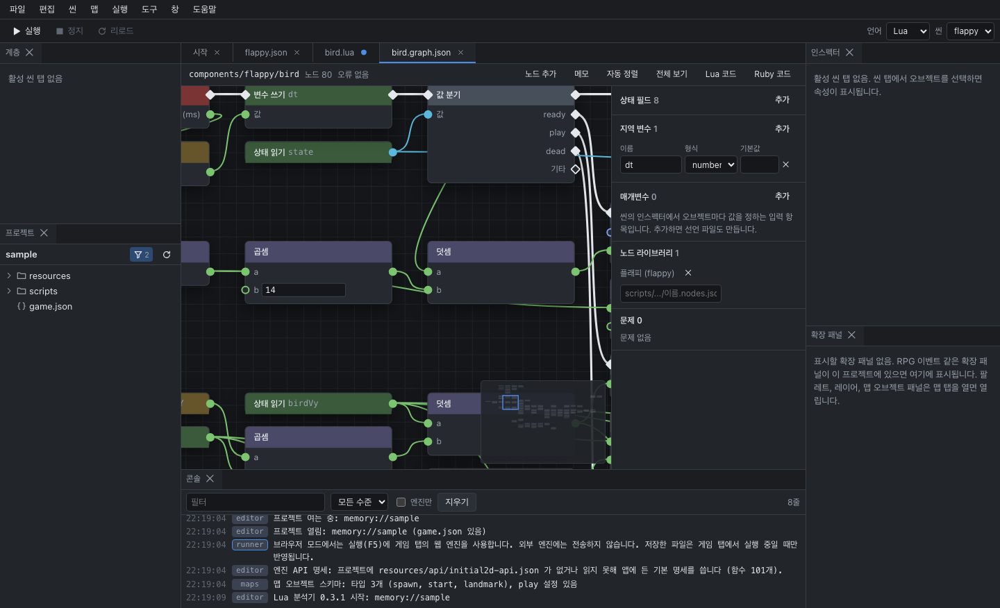

# 비주얼 스크립팅

코드를 쓰는 대신 노드를 선으로 연결해 컴포넌트를 만들 수 있습니다. 그래프를 저장하면 에디터가 같은 내용의 Lua와 Ruby 코드를 만들어 두므로, 게임은 손으로 쓴 컴포넌트와 똑같이 동작합니다. 매개변수, 핫 리로드, 콘솔의 오류 줄도 그대로 됩니다.

## 그래프 컴포넌트 만들기

1. **파일 > 새 그래프 컴포넌트**(Ctrl+Alt+G)에서 이름을 정합니다. 예: `components/coin`
2. `scripts/components/coin.graph.json`이 만들어지고 그래프 편집기가 열립니다.
3. 씬의 오브젝트에 컴포넌트 `components/coin`을 붙입니다 ([씬 편집](scenes.md#컴포넌트-붙이기)). 인스펙터에서 이름을 누르면 코드 대신 그래프가 열립니다.

저장하면 다음 파일이 함께 만들어집니다. 엔진은 그래프가 아니라 이 파일을 읽으므로, git을 쓴다면 함께 커밋합니다.

- `scripts/lua/components/coin.lua`
- `scripts/ruby/components/coin.rb`
- 매개변수를 선언했으면 `scripts/components/coin.json`

만들어진 코드는 첫 줄이 `-- 그래프에서 만든 파일:`이고, 스크립트 편집기에서 읽기 전용입니다. 같은 경로에 손으로 쓴 파일(첫 줄에 이 주석이 없는 파일)이 있으면 그래프는 그 파일을 덮어쓰지 않습니다.

## 노드 다루기

| 조작 | 방법 |
|---|---|
| 노드 추가 | 빈 곳을 오른쪽 클릭이나 두 번 클릭, 또는 위쪽 **노드 추가** |
| 연결 | 포트에서 포트로 끌기 |
| 연결하면서 노드 추가 | 포트에서 끈 선을 빈 곳에 놓기. 그 선에 이을 수 있는 노드만 목록에 나옵니다 |
| 연결 끊기 | 선을 오른쪽 클릭, 또는 Alt를 누른 채 포트 클릭 |
| 값 입력 | 연결하지 않은 입력 포트 옆의 칸에 직접 입력 |
| 화면 이동 | 가운데나 오른쪽 버튼 끌기, Space+끌기 |
| 확대와 축소 | 휠 |
| 화면 맞춤 | F, 또는 위쪽 **전체 보기** |
| 정리 | 위쪽 **자동 정렬** |

복사, 붙여넣기, 복제, 삭제, 되돌리기는 편집 메뉴와 같은 단축키로 됩니다. 오른쪽 아래 미니맵을 누르면 그 자리로 이동합니다.

### 메모

노드를 선택하고 위쪽의 **메모**를 누르면 선택한 노드를 감싸는 메모 상자가 생깁니다. 제목 줄을 끌면 안의 노드가 함께 움직입니다. 메모는 코드에 들어가지 않습니다.

## 노드 종류

| 분류 | 예 |
|---|---|
| 이벤트 | init, update, render, destroy. 컴포넌트의 함수에 해당합니다 |
| 흐름 | 조건 분기, 값 분기, 반복 |
| 변수 | 상태 읽기와 쓰기, 변수 읽기와 쓰기, 매개변수 |
| 오브젝트 | 이 오브젝트, 오브젝트 속성 읽기와 쓰기, props 읽기와 쓰기 |
| 씬 | 오브젝트 찾기, 오브젝트 제거, 씬 전환 |
| 수학, 논리, 텍스트 | 사칙연산, 난수, 범위 제한, 비교, 그리고, 또는, 부정, 텍스트 합치기, 콘솔 출력 |
| 엔진 API | 입력, 소리, 화면 크기 등 |
| 라이브러리 | 프로젝트의 도우미 모듈 (아래 참고) |

흰 마름모 포트는 실행 순서이고, 색이 있는 둥근 포트는 값입니다. 이벤트 노드에서 시작해 실행 선을 따라 차례로 실행됩니다.

## 옆 창

그래프 편집기 오른쪽 창에서 그래프 전체에 걸친 것을 정합니다.

| 항목 | 설명 |
|---|---|
| 상태 필드 | 오브젝트마다 유지되는 값 (속도, 남은 시간 등) |
| 지역 변수 | 한 번의 실행 안에서만 쓰는 값 |
| 매개변수 | 씬의 인스펙터에서 오브젝트마다 정하는 입력 값 |
| 노드 라이브러리 | 이 그래프에서 쓸 도우미 모듈 |
| 문제 | 연결되지 않은 필수 입력, 형식이 맞지 않는 연결 등 |

노드를 선택하면 그 노드의 설정도 이 창에 표시됩니다.

## 오류가 있을 때

문제가 있으면 코드를 만들지 않습니다. 문제가 있는 노드는 테두리로 표시되고, 옆 창의 **문제** 목록을 누르면 그 노드로 이동합니다.

게임 실행 중에 그래프로 만든 컴포넌트에서 오류가 나면, 콘솔의 오류 줄을 눌렀을 때 그래프가 열리고 그 줄을 만든 노드가 선택됩니다.

## 만들어진 코드 보기

위쪽의 **Lua 코드**, **Ruby 코드**로 지금 그래프가 어떤 코드가 되는지 확인할 수 있습니다. 코드를 배우는 데도 쓸 수 있습니다.

## 노드 라이브러리

게임에 공통 상수나 함수를 모아 둔 모듈이 있으면, 그 모듈을 노드로 쓸 수 있습니다. `*.nodes.json` 파일에 모듈의 함수와 상수를 적어 두고 옆 창의 **노드 라이브러리**에 추가합니다. 노드 하나가 Lua에서는 `flappy.GRAVITY`, Ruby에서는 `FlappyCommon::GRAVITY`처럼 각 언어의 이름으로 바뀝니다.
