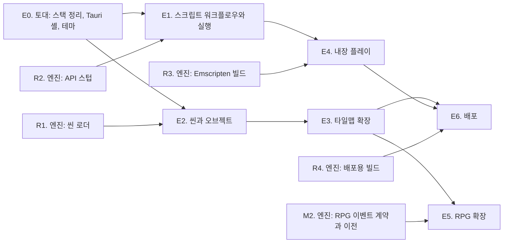

# InitialEditor 로드맵: 게임을 만드는 도구

> 작성일: 2026-09-26. 이 문서는 에디터 계획의 입구이며 진행 상황 추적표를 겸한다.
> 엔진 쪽 로드맵은 Initial2D 저장소의 `docs/plans/index.md`에 있고, 두 문서는 서로를 가리킨다.
> 작업을 시작하기 전에 이 문서의 진행 상황 표를 확인하고, 작업이 끝나면 반드시 갱신한다.

## 1. 한 문장

> **에디터에서 프로젝트를 열고, 씬에 오브젝트를 놓고, 스크립트를 쓰고, 실행 버튼을 누르면
> Initial2D에서 그 게임이 돈다.** 타일맵은 에디터가 기본으로 아는 것이 아니라
> 확장(플러그인)이 씬에 놓는 오브젝트의 한 종류다.

엔진의 원칙("이 기능이 플래피버드에도 말이 되는가")을 에디터에도 그대로 적용한다.
에디터 코어는 장르를 모르고, 타일맵과 RPG 이벤트는 확장이 더한다.

## 2. 결정 요약

저자의 요구 여섯 가지에 대한 답이다. 근거와 대안은 각 문서에 있다.

| 요구 | 결정 | 문서 |
|---|---|---|
| 기술 스택 검토 | **Tauri 2 데스크톱 셸 + TypeScript, React 18, PIXI 8, Monaco, dockview.** Electron은 제외한다 (저자 판정: 무겁다). 브라우저 + 브리지 서버 모드는 개발용으로 남긴다 | [01-tech-stack.md](01-tech-stack.md) |
| 어디까지, 어떤 장르 | **장르 중립 코어 + 확장.** 코어는 프로젝트, 자산, 씬과 오브젝트, 스크립트, 실행, 콘솔, 테마까지. 타일맵과 RPG(이벤트, 데이터베이스)는 확장 | [02-scope-and-screens.md](02-scope-and-screens.md) |
| 화면과 기능 | 도킹 패널: 계층, 프로젝트, 씬 뷰와 스크립트 탭, 인스펙터, 콘솔. 레이아웃은 저장되고 프리셋 셋(씬, 스크립트, 타일맵) | [02-scope-and-screens.md](02-scope-and-screens.md) |
| 로컬 파일과 크로스 플랫폼 | 프로젝트는 `game.json`이 있는 폴더. 파일 접근은 `ProjectBackend` 인터페이스 하나에 구현 둘(Tauri, 브리지). macOS 1순위, Windows 2순위, Linux 3순위 | [03-project-and-runtime.md](03-project-and-runtime.md) |
| 인게임 실행 | **두 모드.** 1차는 엔진 실행 파일을 프로젝트 폴더에서 띄우는 외부 프로세스(콘솔 연결, 저장 시 핫 리로드). 2차는 Emscripten으로 빌드한 엔진을 에디터 안 게임 뷰에 올리는 내장 실행 | [03-project-and-runtime.md](03-project-and-runtime.md), [e4-embedded-play.md](e4-embedded-play.md) |
| 웹 배포 (Cloudflare Pages) | **겸한다.** 같은 앱을 저장소의 Cloudflare Pages 로 계속 낸다. 브라우저판은 로컬 폴더를 브라우저의 폴더 열기(File System Access API, Chromium 계열)로 직접 열고, 게임은 엔진의 WASM 빌드(R3)로 페이지 안에서 돌린다. Tauri 앱은 엔진 프로세스 실행과 파일 감시가 되는 완전판이다. 둘은 `ProjectBackend` 구현만 다르다. 브리지 서버 모드는 개발용으로 남는다 (2026-09-26) | [e4-embedded-play.md](e4-embedded-play.md) |
| 테마 | CSS 변수 토큰 한 벌, `data-theme`로 다크와 라이트, 기본은 OS 설정. Monaco와 씬 뷰 배경도 토큰에서 | [02-scope-and-screens.md](02-scope-and-screens.md) 6절 |
| 타일맵은 확장으로 | 확장 API(`registerObjectType` 등)의 첫 소비자가 타일맵 확장. 옛 에디터의 타일맵 기능은 전부 그 확장으로 옮긴다 | [04-extensions-and-tilemap.md](04-extensions-and-tilemap.md) |

한 가지를 덧붙인다. **에디터가 만든 데이터가 게임에서 돌아가려면 엔진 쪽에 읽는 쪽이 있어야 한다.**
씬 파일(`resources/scenes/*.json`)을 읽어 오브젝트를 만드는 씬 로더는 C++이 아니라
스크립트 레이어(Lua와 Ruby)에 둔다. 엔진 저장소의 선행 작업이며 3절의 R1이다.

## 3. 현재 상태 (2026-09-26 조사)

### 에디터 (이 저장소)

| 항목 | 상태 |
|---|---|
| 구성 | yarn 1.22 워크스페이스 둘. `packages/initial-editor`(코어 클래스, PIXI 7.3.3, 2020년 DOM 셸)와 `packages/renderer`(React 18, Vite 6) |
| 규모 | TS와 TSX 12,601줄. 큰 파일은 `tilemap.ts` 1,052줄, `global-style.ts` 754줄, `app.ts` 650줄, `LuaEditor.tsx` 570줄 |
| 되는 것 | 4레이어 타일맵 그리기(펜, 사각형, 채우기), 타일셋 팔레트, 레이어 창, 브리지를 통한 스크립트 편집과 저장과 핫 리로드, 맵 열기와 저장과 내보내기(포맷 v1), 새 맵 |
| 안 되는 것 | 플레이 테스트(`alert` 스텁), 이벤트와 통행 편집, 맵 포맷 v2(열면 거부, 저장하면 `events` 유실), 오토타일(`AutoTile.ts`는 있으나 미사용), 오브젝트 개념 |
| 의존성 | 같은 역할이 두 벌씩이다. 번들러(webpack과 vite), DI(tsyringe와 typedi), 상태(mobx와 recoil), 스타일(styled-components와 tailwind), sass(dart-sass와 sass). babel과 jQuery 타입 잔재. `ElectronService`는 `@deprecated` |
| 테마 | CSS 변수 7개와 `conf/theme.json`, `ThemeManager`가 다크와 라이트를 바꾼다. 토큰이 너무 적어 패널이 늘면 못 버틴다 |
| 테스트 | `map-format.test.mjs` 하나(node --test), 픽스처 하나. 렌더링과 UI 테스트 없음 |
| 이력 | 2020년 Electron으로 시작, 2023년 웹으로 포팅(Electron 보일러플레이트 제거), 2025년 라이브러리 방식과 yarn classic 복귀, 2026-08 브리지 연동. `feature/initial2d-bridge`의 커밋 셋은 **아직 푸시되지 않았다** |

결론: **재작성에 가깝다.** 살릴 것은 순수 로직이다. `map/MapFormat.ts`(변환), `AutoTile.ts`(Wang blob),
`TilemapHistory.ts`(되돌리기), 채우기 알고리즘, `bridge/BridgeClient.ts`, 그리고 `LuaEditor.tsx`의
외부 변경 처리 정책(미수정이면 자동 재로드, 수정 중이면 배너). 셸과 렌더링과 메뉴 체계는 새로 짠다.

### 엔진 (Initial2D, 에디터가 기대는 것)

| 항목 | 상태 |
|---|---|
| 실행 제어 | 작업 폴더의 `./game.json`(창 크기, `renderScale`, `script`)과 환경 변수(`INITIAL2D_SCENE`, `INITIAL2D_SCRIPT`, `INITIAL2D_HMR`, `INITIAL2D_EXIT_AFTER`, `INITIAL2D_SCREENSHOT`, `INITIAL2D_WINDOW` 등). `Initial2D --features`로 지원 언어를 찍는다 |
| 핫 리로드 | TCP 5959, `I2DH` 프로토콜(파일 묶음을 보내면 스크립트 VM을 다시 시작) |
| 브리지 서버 | `tools/bridge/server.js`, HTTP 5960. `/api/project`, `/api/files/*`, `/api/reload`, WebSocket `/ws`(외부 변경 알림) |
| 데이터 | 맵 포맷 v2(`events` 배열), 커맨드 17종(스키마 파일은 계획만 있다), 씬 파일 없음 |
| 스크립트 | Lua 5.3(기본)과 mruby 4.0, 같은 API. `scripts/lua/`와 `scripts/ruby/` |
| 없는 것 | 씬 로더, API 스텁, Emscripten 빌드, 프로젝트 폴더를 인자로 받는 실행(지금은 작업 폴더가 곧 프로젝트) |

## 4. 단계 개요와 의존 관계

| 단계 | 문서 | 한 줄 요약 | 핵심 산출물 | 권장 모델 |
|---|---|---|---|---|
| E0 | [e0-foundation.md](e0-foundation.md) | 스택을 정리하고 Tauri 셸과 도킹 화면과 테마를 세운다 | `packages/core`, `packages/app`, `src-tauri/`, `ProjectBackend` 둘, 테마 토큰 | **Fable 5** |
| E1 | [e1-scripting.md](e1-scripting.md) | 스크립트를 쓰고 저장하면 게임이 다시 뜨고, 실행 버튼으로 게임을 띄운다 | Monaco 에디터, API 자동완성, 외부 프로세스 실행과 콘솔 | Opus 5 |
| E2 | [e2-scene.md](e2-scene.md) | 씬에 오브젝트를 놓고 저장하면 게임이 그 씬을 연다 | 씬 포맷 v1, 계층과 인스펙터와 씬 뷰, 되돌리기, 스크립트 컴포넌트 | **Fable 5** |
| E3 | [e3-tilemap.md](e3-tilemap.md) | 게임의 맵을 연다: 실제 타일셋으로 칠하고, 통행을 칠하고, 몬스터와 흔적 같은 배치를 맵 위에서 옮기고, 그 자리에서 실행한다 | 맵 모델(`ext-tilemap/model`), 맵 뷰(PIXI), 팔레트와 레이어 패널, 오브젝트 레이어와 스키마 폼, 여기서 실행. 엔진 짝은 알데바란 배치의 맵 이전(M1) | **Fable 5** |
| E4 | [e4-embedded-play.md](e4-embedded-play.md) | 게임이 에디터 안에서 돌고, 같은 앱이 웹(Cloudflare Pages)에서도 쓸모 있다 | 게임 뷰 패널, WASM 엔진 로더, 브라우저 폴더 열기 백엔드 | **Fable 5** |
| E5 | [e5-rpg.md](e5-rpg.md) | 항구 마을 맵에 NPC 를 놓고 커맨드를 적고 저장하면 게임에서 말을 걸 수 있다 (Lua 한 줄 없이) | `packages/ext-rpg`(이벤트 레이어, 커맨드 목록 편집기, 이 이벤트 앞에서 실행), 타일맵 확장의 레이어와 실행 제공자 자리, `yarn test:engine-events`. 엔진 짝은 M2 | **Fable 5** |
| E6 | [e6-packaging.md](e6-packaging.md) | 설치 하나로 편집하고 실행한다: 세 OS 번들, 앱에 든 엔진, 설치된 앱의 자체 시험, 안드로이드 스테이징, 웹판 헤더 | Tauri 사이드카와 신뢰 규칙, `release.yml`(산출물), 자체 시험, `_headers`. 엔진 짝은 R4 | Opus 5 (사이드카와 자체 시험은 **Fable 5**) |
| R1 | Initial2D `docs/plans/index.md` 에디터 트랙 | 엔진: 씬 로더 (Lua와 Ruby, `scripts/*/scene_loader`) | 씬 포맷 v1 픽스처, 로더, 새 프로젝트 템플릿 | **Fable 5** |
| R2 | 위와 같음 | 엔진: API 스텁과 대조 테스트 | `resources/api/initial2d.lua`(주석 기반 타입), Ruby 스텁, 표면 대조 테스트 | Opus 5 |
| R3 | 위와 같음 | 엔진: Emscripten 빌드 | `build-web/`, CMake의 EMSCRIPTEN 분기, 핫 리로드 서버 제외 | **Fable 5** |
| M2 | Initial2D `docs/plans/m2-rpg-events.md` | 엔진: RPG 이벤트 데이터 계약과 데모 이벤트의 이전 | `event-commands.json`, `rpg-game.json`, 검사와 trace, `tools/export_events.py` | **Fable 5** |
| R4 | Initial2D `docs/plans/r4-dist-build.md` (E6 문서 3.1절) | 엔진: 배포용 빌드 (정적 링크, 템플릿 묶음) | `tools/build_dist.sh`, `tools/check_dist.sh`, `tools/pack_templates.py`, 타일맵 템플릿, `dist.yml` | Opus 5 |

모델 선정 기준은 엔진 로드맵과 같다. 최소 기준선은 Opus 5, 뒤 단계의 토대가 되는 설계(E0의 패키지 경계와 백엔드 계약,
E2의 씬 포맷, E4의 파일 스테이징)는 Fable 5.

순서에 대한 메모: E1과 E2는 E0 뒤에 병행할 수 있다. E1이 먼저인 이유는 저자가 "이 에디터에서 가장 중요한 건
스크립트 작성"이라고 했기 때문이며, E1은 R1 없이 완성된다. E3은 E2의 확장 API가 있어야 시작한다.

## 5. 이후 후보

E5 와 E6 은 계획 문서가 생겨 4절로 옮겼다 (2026-09-27).

에디터를 끝낸 뒤의 목표(프로젝트 뷰 필터, 스크립트 매개변수와 컴포넌트, 비주얼 스크립팅 검토)는 [next-goals.md](next-goals.md)에 있다.
비주얼 스크립팅의 검토 문서는 [visual-scripting-review.md](visual-scripting-review.md)이고, 권고(그래프에서 Lua 와 Ruby 를 만든다)대로 만드는 계획은 [visual-scripting.md](visual-scripting.md)다.

여기부터는 순서가 아니라 후보다. 만들려는 게임이 요구하는 것이 다음이 된다.

| 후보 | 언제 필요해지는가 | 어디에 붙는가 | 크기 |
|---|---|---|---|
| 오토타일 | 맵을 손으로 그릴 때. 엔진 `roadmap-v2.md` 13단계의 "굽기" 방식 | 타일맵 확장 | 중 |
| 애니메이션 편집기 | 시트 프레임 구간을 눈으로 정할 때 | 코어 자산 검사기 | 소 |
| 써드파티 확장 동적 로딩 | 확장이 다섯을 넘고 저장소 밖에서 만들 때 | 확장 호스트 | 중 |
| 언어 서버(LSP) | 자동완성 스텁으로 부족할 때. 단계와 선택지는 이슈 [#53](https://github.com/biud436/InitialEditor/issues/53), 계획은 [language-server.md](language-server.md) (단계 0, 1, 2 완료) | Monaco + 사이드카 | 중 |

## 6. 하지 않기로 한 것

- **Electron.** 저자 판정(2026-09-26)이 "너무 무겁다". 대안은 01 문서.
- **에디터 자체의 스크립트 언어.** 언어는 엔진이 이미 둘(Lua, Ruby) 가지고 있다. 비주얼 스크립팅은 저자 요청(2026-09-27)으로 검토했고, 그래프가 새 실행기가 아니라 두 언어의 코드를 만드는 방식으로 만든다 ([visual-scripting.md](visual-scripting.md)).
- **에디터가 렌더링 규칙을 다시 구현하는 것.** 씬 뷰는 편집용 근사이고, 진짜 화면은 게임 뷰(실행)가 보여 준다. Unity의 Scene과 Game이 다른 것과 같다.
- **RPG 개념의 코어 진입.** 이벤트, 대화창, 데이터베이스는 확장이다. 코어에 `npc`가 생기는 순간 플래피버드가 못 쓰는 에디터가 된다.
- **협업, 클라우드, 계정.** 로컬 폴더가 프로젝트다.

## 7. 진행 상황

> 상태: ⬜ 대기, 🟡 진행 중, ✅ 완료. 각 단계 문서 안의 체크리스트를 먼저 갱신한 뒤, 이 표의 상태와 메모를 함께 갱신한다.

| 단계 | 상태 | 마지막 갱신 | 메모 |
|---|---|---|---|
| E0. 토대 | ✅ 완료 | 2026-09-26 | 완료 기준 6개 충족 (Tauri 창의 폴더 선택과 화면은 저자 확인 필요). 워크스페이스를 `core`, `backend-bridge`, `backend-tauri`, `app`, `ext-tilemap`, `src-tauri` 로 재편하고 옛 패키지는 `legacy/`(테스트 23건과 빌드 그대로, 2026-09-27 E3에서 삭제). 코어(백엔드 계약, 경로, 문서와 되돌리기, 커맨드와 단축키, 메뉴, 확장 API, 프로젝트, 로그, 설정, UTF-8) 단위 48건. 브리지 백엔드는 엔진 브리지 0.2.0(PR #38: 폴더 API, `game.json`, `.rb` 리로드, 변경 종류)에 기대며 적합성 14건이 메모리와 브리지 양쪽 통과. Rust 셸은 명령 18개(표 + `project_close`, `startup_open_path`), `cargo test` 38건(원자 쓰기 경쟁, 심링크 탈출, I2DH 픽스처가 엔진 인코더와 바이트 일치, notify 감시의 self/external). React 셸은 dockview 패널 여섯과 프리셋 셋, HTML 메뉴 바와 Tauri 네이티브 메뉴가 같은 커맨드 레지스트리에서, 프로젝트 트리와 콘솔과 상태 바와 토스트와 모달, 미리보기 문서 셋, 테마 토큰과 색 리터럴 검사. 검수: 타입과 린트, Vitest 69건, Playwright 6건(메모리 5, 브리지 1), `yarn tauri build --debug` 로 .app 과 .dmg, 빌드한 앱이 임시 프로젝트를 열어 레이아웃 파일을 쓰는 것까지. **배운 것** 은 e0 문서 구현 노트 (Yarn 은 Berry, Vitest 하나, `TextEncoder` 대신 UTF-8 코덱, 절대 경로 거부, Tailwind 제외, Berry 의 `yarn workspace <옛 패키지> run` 문제). **남은 것**: Windows 와 Linux 는 E1 과 E6 에서, CI 의 GitHub 첫 실행은 PR 에서 본다 |
| E1. 스크립트 워크플로우와 실행 | ✅ 완료 | 2026-09-27 | 완료 기준 중 Windows 를 뺀 다섯 충족 (Windows 는 저자 실기). **편집기**: Monaco 문서(lua, rb, json, txt, md, csv, fnt), 저장은 LF, dirty 는 버전 비교, 외부 변경은 미수정이면 재로드하고 수정 중이면 배너, 탭 오갈 때 커서 유지, 테마 토큰으로 Monaco 테마, 설정(글꼴, 탭, 줄바꿈, 미니맵). **자동완성**: 엔진 R2 의 `resources/api/initial2d-api.json` 을 읽어 Lua 전역과 모듈 멤버, Ruby 모듈 메서드와 `Keys::` 와 `:symbol`, 시그니처 도움말과 호버, 씬 계약 스니펫. **찾기**: 편집기 안(Ctrl+F)과 프로젝트 전체(Ctrl+Shift+F, 대소문자와 정규식). **새 스크립트**(Ctrl+Alt+N, 씬과 컴포넌트 템플릿). **실행기**: 엔진 경로 탐색 넷(설정, `.initial-editor/engine`, `build/Initial2D`, 형제 저장소)을 `--features` 로 찔러 확인, F5/Shift+F5/다시 시작, mruby 없는 빌드 거부, 출력을 콘솔에 링크로(Lua, Ruby 백트레이스, Windows 경로), 상태 바에 PID 와 경과, 저장 시 핫 리로드(Tauri 는 파일을 모아 보내고 브리지는 서버가 모은다). **엔진 수정**(PR #39): Lua 오류를 pcall 로 보고하고 종료 코드 1, 파이프 stdout 줄 버퍼링. 검수: Vitest 187, Playwright 19(메모리 18, 브리지 1), 진짜 엔진 핫 리로드 교차 검사(`yarn test:engine`), 타입과 린트와 색 검사 통과. 2026-09-27: WebKit(macOS 앱의 WKWebView)에서 둘째 스크립트 탭의 입력이 첫 탭의 파일로 가던 문제를 고쳤고, 스크립트 편집 스펙과 스크립트 탭 여럿 스펙을 WebKit 으로도 돌린다 (`yarn test:e2e:webkit`, CI 의 web 잡) |
| E2. 씬과 오브젝트 | ✅ 완료 | 2026-09-26 | 완료 기준 6개 충족. **코어**: 씬 포맷 v1 파서와 직렬화(모르는 키 보존, 키 순서 고정), 의미 검사(엔진 로더와 같은 목록), 명령 객체(추가, 삭제, 이동 합치기, 속성, 이름, 순서, 스크립트), 씬 문서와 선택. **씬 뷰**(PIXI 8): 격자와 스냅과 줌과 팬, 카메라 사각형, 클릭과 상자 선택, 끌기(되돌리기 한 단계), 방향키, 테마 색, 이미지 캐시, 확장 타입은 `createSceneNode`. **씬 도구**: 계층(순서 끌기, 눈, 이름 바꾸기, 컨텍스트 메뉴), 인스펙터(공통 칸, 스프라이트와 글자 인스펙터, 스크립트 붙이기와 만들기, 검사 결과), 새 씬과 오브젝트 추가와 시작 씬 지정과 복사와 붙여넣기, `run.fromScene`(Ctrl+F5). **템플릿**: 엔진의 씬 로더와 진입 파일과 플래피 씬을 `yarn sync:templates` 로 복사(MANIFEST sha256)해 새 프로젝트(빈, 플래피, Lua 와 Ruby)를 만든다. 검수: Vitest 235+, Playwright 8(씬 뷰 3, 씬 도구 3, 스모크), `yarn test:engine-scene` 26건(템플릿 둘 x 언어 둘을 진짜 엔진이 돌린다), 엔진 쪽 R1 씬 테스트 442 PASS. 엔진 짝은 Initial2D R1(PR #41, #42) |
| E3. 맵 편집 | ✅ 완료 | 2026-09-28 | **옛 완료 기준까지 (2026-09-28)**: 개정 전 계획의 항목과 완료 기준도 모두 닫았다. 통행이 엔진의 막힘과 같은지, 항구 마을을 칠해도 인수 시나리오가 그대로인지, 새 맵의 골든을 `yarn test:engine-map`(PR #65, 릴리스 워크플로의 Linux 잡에서도 돈다)이 진짜 엔진으로 보고, 저장 안 된 문서가 있으면 실행이 먼저 묻는다(PR #64). 나머지는 맵 뷰 설계로 대체했거나 이유를 적고 버렸다 (v1 내보내기). 엔진 러너의 골든 허용치가 타일 한 칸 변화를 못 보는 것은 엔진 이슈 #61. **완료 (2026-09-27)**: 개정 완료 기준 넷 모두 충족. 마지막 기준(Tauri 창의 숲이 게임과 같다)은 E6 PR #52 의 CI 에서 macOS 설치본의 자가 검사가 보이는 창으로 숲을 칠해 저장하고 게임 화면과 레이어마다, 칸마다 견주어 닫았다. **방향을 바꿨다** (2026-09-26 저자 판정: "단순 스크립트 에디터로는 아무것도 할 수 없다"). 옛 에디터 기능의 이전보다 **알데바란 맵을 실제로 고치는 일**을 먼저 한다. **된 것**: 맵 모델(v1과 v2, 고정 형식, 오브젝트 레이어, 스키마, 엔진의 실제 맵 다섯 장 왕복), 맵 뷰(실제 타일셋, 덩어리 단위 다시 그리기), 도구 일곱(펜, 사각형, 채우기, 지우개, 스포이드, 통행, 오브젝트), 팔레트와 레이어와 맵 오브젝트 패널, 스키마 폼 인스펙터, 여기서 실행(Ctrl+F5). 2026-09-27: 새 맵(Ctrl+Alt+M), 크기 바꾸기(기준점, 되돌리기), 맵 오브젝트의 잘라내기와 복사와 붙여넣기와 복제, 맵 탭을 열면 맵 패널을 더하기, 씬의 타일맵 오브젝트(씬 뷰에 맵을 그리고, 인스펙터에서 맵 고르기와 맵 열기, 엔진 `validate`와 같은 검사기, 배경 대상 고르기), 오토타일 모델, `legacy/` 삭제(옛 기능 이전표는 e3 문서). 검수에서 나온 것을 고쳤다 (2026-09-27): 저장 직전 디스크와 견주는 저장 충돌 모달(03 문서 파일 규칙 4, 모든 문서와 모두 저장), 스키마의 `play.maps`(여기서 실행을 켤 맵 이름 글롭), 붙여넣기와 복제는 x로만 한 칸이고 잘라내고 붙이면 id를 지키는 옮기기, 채우기 한도는 맵의 칸 수, 비었거나 공백뿐인 필수 글 칸은 검사 오류, 씬 뷰의 타일맵 쌓는 순서를 엔진 씬 로더와 같게(바닥 레이어는 모든 오브젝트 아래, 나머지는 위), 맵 파일이 없는 타일맵은 씬 검사 오류, 확장 패널 안내문. 두 번째 검수에서 나온 것 (2026-09-27): 쓰는 중에 들어온 저장은 그 쓰기를 기다렸다가 최신 내용으로 다시 저장(합치는 것은 디스크 확인과 모달을 기다리는 동안만), 모달의 다시 읽기가 실패하면 저장 실패가 아니라 "다시 읽지 못했다"로 알림, `play.maps`가 받지 않는 맵에서도 여기서 실행과 Ctrl+F5를 켜 두고 누르면 이유를 토스트와 콘솔로 알림(툴팁에도 이유), 맵 파일이 있어도 엔진이 열지 못하는 맵이면 씬 검사 오류(엔진의 `Tilemap::load` 규칙과 타일셋 그림을 그대로 본다). 엔진 짝은 M1(PR #45, 배치를 맵의 `objects`로), #46(구덩이 위 시작 x), #47(시작마다 배치 줄), #48(맵과 몬스터 검수 줄 `INITIAL2D_ALDEBARAN_TRACE`). 검수: 타입과 린트와 색 검사, Vitest 704, Playwright 44(인수 테스트 `aldebaran-map.spec.ts`가 엔진의 숲 사본을 브리지 모드로 고쳐 저장하고 Ctrl+F5가 넘긴 변수로 Lua와 Ruby를 돌려, 엔진의 검수 줄로 저장한 맵의 타일 검사합과 옮긴 늑대의 자리를 엔진이 읽었는지 맞춰 본다). **남은 것**: 개정 완료 기준 넷 중 하나, Tauri 창의 숲이 게임과 같은지. 창을 띄울 수 없는 헤드리스 환경에서는 확인할 수 없어 E6의 설치된 앱 자체 시험으로 옮긴다: 설치한 앱이 엔진 저장소의 숲을 Tauri 창에서 열어 맵 뷰를 캡처하고 게임 프레임과 견준다. 그 시험이 통과할 때까지 E3은 진행 중이다 (2026-09-27: E6 자가 검사의 숲 단계로 만들었고 이 맥의 숨은 Tauri 창에서 통과했다. 숲 단계는 deco 의 한 칸을 칠해 저장하고, 판정이 저장한 맵으로 그린 기준과 레이어마다, 칠한 칸까지 견준다(레이어 하나를 빼고 그린 게임은 실패한다). `release.yml` 의 보이는 창 실행이 남았다. 브리지 모드에서는 인수 테스트가 같은 번들로 숲을 열어 크기와 오브젝트 수를 맞춰 본다). (엔진 스키마의 `play.maps`(`aldebaran_*`)는 엔진 PR #49 로 들어갔다.) 창 닫기와 새로 고침 때 저장하지 않은 변경을 지키는 일은 E4 쪽에서 한다. 옛 완료 기준(이 뒤에 한다)은 `legacy/` 삭제와 README만 충족했고, 항구 마을을 칠해 저장한 뒤 인수 시나리오 무변경 통과, 새 맵을 씬의 타일맵으로 저장한 화면의 골든, 이전표의 남음 항목(옛 v1 내보내기, 원형, 게임 폴더 열기, 이벤트와 데이터베이스는 E5), 통행 편집과 엔진 막힘의 씬 테스트가 남았다 |
| E4. 내장 플레이와 웹판 | ✅ 완료 | 2026-09-27 | 완료 기준 다섯 충족. **게임 뷰**: 엔진의 WASM 빌드(R3, `yarn sync:engine-web` 으로 `public/engine/` 에 사본과 MANIFEST)를 문서 탭 "게임"의 canvas 에 올린다. 파일은 백엔드로 읽어 MEMFS 에 올리고(동시 8개), 저장하면 바뀐 파일만 다시 올려 `reload()`. 탭은 문서 영역 오른쪽 새 그룹에 열리고 옮긴 자리를 기억한다. 실행 단축키는 스크립트 편집기와 canvas 안에서도 에디터가 받는다. 오류는 네이티브와 같다 (같은 줄과 링크, 시작과 Update 의 오류는 종료 코드 1, 저장한 스크립트의 오류는 스크립트만 멈추고 고쳐 저장하면 다시 그린다, 엔진 밖 예외는 `fatal:` 과 종료 코드 1). mruby 가 든 웹 빌드면 Ruby 게임도 돈다 (마일스톤 6). Ruby 의 C 를 거치는 끝없는 재귀는 `SystemStackError`, 바인딩 안의 C++ 예외는 `rescue` 로 잡히는 `RuntimeError` 이고 잡지 않으면 네이티브와 같은 줄 묶음과 종료 코드 1 (엔진 470074b, e2e 가 네이티브의 줄과 견준다). 알데바란이 헤드리스 크로미움 게임 탭에서 60 FPS. **같은 화면**: 인수 씬의 타이틀 20 프레임을 네이티브(헤드리스)와 게임 탭에서 견주면 다른 픽셀 0% 나 1.44% (허용 2%, 엔진 골든 규칙), 차이는 메뉴 커서의 깜빡임 위상뿐 (e2e). **웹판**: 브라우저 폴더 백엔드(`packages/backend-fsaccess`, File System Access API, 폴링 감시), 일반 창이라고 확신할 때만(JS 힙 한도를 알고 저장 할당량이 그 두 배와 4 GiB 보다 크다) 기억한 핸들을 꺼내고 나머지는 폴더 고르기로 (시크릿 창에서 꺼내면 브라우저가 통째로 죽는다). Ctrl+O 는 샘플 뒤에도 폴더 고르기이고, 저장하지 않은 문서를 묻는 곳에서 취소하면 기억한 폴더도 열린 프로젝트도 그대로다. 뜨는 중에 모은 저장은 엔진이 첫 프레임을 돈 뒤에 올리고(그 전에 끝나거나, 시작 스크립트나 첫 update의 오류로 끝나는 중이면 버리고 한 줄. 실행 중 스크립트 오류 뒤 게임이 끝나기 전의 저장도 버리고 한 줄이며 종료 코드는 엔진이 준 1), 밖의 엔진으로 보낼지는 백엔드가 정하며(메모리 백엔드는 늘 보내지 않는다), 꺼져 있는 리로드의 단축키도 브라우저의 새로 고침으로 가지 않고, 메모리 프로젝트에 저장한 것이 있으면 떠나기 전에 묻는다. Ruby 예외를 C를 거친 깊은 재귀 너머에서 `rescue`하는 비용(크롬에서 수십 ms)은 WebAssembly 예외 처리의 알려진 한계로 적었다. 검수: Vitest 586, Playwright 64(게임 뷰 24, 웹 폴더 8 포함), 타입과 린트와 색 검사. **남은 것**(완료 기준 밖): 큰 파일의 요청 시 읽기, 엔진 README 의 실행 링크(배포는 저자 결정), 진짜 로컬 폴더로 시크릿 창의 폴더 고르기 확인(저자), 엔진 브랜치 `fix/wasm-lua-errors` 를 master 에 합친 뒤 다시 동기화 |
| R1. 엔진 씬 로더 | ✅ 완료 | 2026-09-26 | 엔진 PR #41. `scripts/lua/scene_loader.lua`와 `scripts/ruby/scene_loader.rb`가 `resources/scenes/*.json`(씬 포맷 v1)을 읽고 검사해 node, sprite, text를 만들고 확장 타입은 `scene_types/`(타일맵 먼저)에 맡긴다. 플래피를 씬으로 다시 짰고 새 프로젝트 템플릿과 픽스처가 있다. C++ 무수정. 엔진 검수 442 PASS. E2의 템플릿과 `yarn test:engine-scene`이 쓴다 |
| R2. 엔진 API 스텁 | ✅ 완료 | 2026-09-26 | 엔진 PR #42. `resources/api/initial2d-api.json`이 Lua와 mruby 바인딩 전부(모듈 7, 함수 58, 클래스 3과 메서드 58, `Keys` 상수 82, 씬 계약)를 적고, `tools/gen_api_stubs.py`가 EmmyLua와 Ruby 스텁을 만든다. 두 언어의 표면 테스트가 명세와 VM을 양쪽으로 대조한다. E1 자동완성이 이 JSON을 읽는다 |
| R3. 엔진 Emscripten 빌드 | ✅ 완료 | 2026-09-26 | 엔진 PR #44. `tools/build_web.sh`(emcmake, SDL2 포트, 핫 리로드 서버와 mruby 제외. mruby 는 뒤에 들어갔다, E4 마일스톤 6), 브라우저가 프레임을 돌리는 `App::StepFrame`, 로더 `tools/web/initial2d-loader.js`, 웹 스모크(헤드리스 크로미움의 알데바란 타이틀이 네이티브 골든과 픽셀 차이 0). 엔진 검수 446 PASS |
| E5. RPG 확장 | ✅ 완료 | 2026-09-28 | **완료 (2026-09-28, PR #57)**: 완료 기준 일곱 모두 충족. 첫째(Tauri 창의 이벤트 17개)와 셋째(Tauri 프로세스 모드의 이 이벤트 앞에서 실행)는 설치본 자가 검사의 항구 마을 단계가 닫았다: PR #57 의 `release.yml` 에서 macOS 93 PASS, Linux 88 PASS (보이는 창). 마일스톤 3 의 브리지 왕복은 진짜 Chrome 창의 조작으로 했다 (옮기면 `y` 한 줄, 되돌리면 원본과 같은 바이트). 계획은 [e5-rpg.md](e5-rpg.md) (결정 기록 포함). 엔진 짝 M2의 두 PR이 병합되었다: 계약(엔진 #49)과 데모 이벤트의 이전(엔진 #50). **마일스톤 2 완료** (`feat/e5-rpg`): DOM 없는 `packages/ext-rpg` 모델(스키마와 게임 설정 읽기, 엔진과 같은 경로의 검사, 되돌릴 수 있는 편집 명령, 앞 칸과 실행 변수), 엔진의 모든 맵 바이트 왕복, 경로 픽스처 대조, `yarn sync:rpg`, `yarn test:engine-events`(모델의 명령으로 만든 이벤트를 진짜 엔진이 판 넷과 대조 셋으로 돌린다, 검사 78개, 실행 기록은 e5 문서의 구현 노트). 검수 뒤 고친 것: 여관 도착 판의 대상을 시작과 다른 칸으로, 최상위 `events`의 `null`과 빈 `{}`, 빈 `script` 이름은 오류, 모르는 키 `__proto__` 보존, 정수 모양 키의 규칙 문서화. 앱과 맞닿는 마일스톤 4 부터는 E4 병합 뒤에 한다 (같은 파일을 고친다). **마일스톤 4의 확장 자리** (`feat/e5-layer`): 코어의 `exportsOf`와 `workspace`, 타일맵의 맵 레이어와 실행 제공자 자리(`contrib.ts`, 문서의 레이어 상태, `ext` 대상), `packages/ui`(입력 부품), 앱의 레이어 컨테이너와 도구 넘기기와 레이어 패널 줄과 인스펙터 자리와 도구 단축키와 확장 패널 탭과 저장 전 질문. **마일스톤 4의 이벤트 레이어** (`feat/e5-layer`): 앱이 `rpgExtension`을 켜고, `rpg-game.json`에 등록된 맵에 이벤트 레이어가 붙는다 (항구 마을 17개가 게임과 같은 자리에 CharSet 프레임이나 트리거 표식으로). 이벤트 도구(N: 고르기, 끌기, 구역 가장자리, 더블클릭 놓기, Delete, Ctrl+C/V/D는 레이어 도구의 키), 인스펙터(이벤트 칸과 커맨드 목록 편집기), 이벤트 목록 패널(찾기, 시작 상태를 `.initial-editor/rpg-play.json`에), RTP 쌍둥이 맵과 모르는 스키마 버전의 읽기 전용, 스키마를 읽을 때마다 `refreshLayer`. `yarn test:engine-events`는 앱과 같은 길(`MapDocument`에 붙은 레이어)로 검사 80개 통과. **마일스톤 6의 실행** (`feat/e5-layer`): 타일맵 자리에 실행 길(`play`, 앱이 여기서 실행과 같은 길을 넣는다), RPG 실행 제공자 `rpgPlay`(priority 10, 고른 이벤트 앞, 커서, 뷰 가운데, 정의 파일의 시작), 이 이벤트 앞에서 실행과 자동 재생(인스펙터 단추, 맵 메뉴, 목록 우클릭, parallel은 거절), 시작 상태를 세 실행에, 러너의 언어 검사는 덮은 `INITIAL2D_SCRIPT`로. 러너 단위 테스트(제공자의 변수가 프로세스 실행의 `RunSpec.env`에 그대로), `rpg-events.spec.ts`(메모리 모드의 놓기부터 저장과 실행 변수, 브리지 모드의 게임 탭 자동 재생), `yarn test:engine-events` 판 다섯 검사 90개 통과. **통합 검수** (`feat/e5-layer`, 코드 커밋 다섯과 문서 커밋): 설치, 타입, 린트, 색 검사, Vitest 1308건, 빌드, Playwright 83건 전부, `yarn test:engine-events` 판 8 검사 90개(건너뛰지 않음) 통과. 코어 레지스트리 등록을 MobX 액션 안으로, 게임 뷰 e2e의 편집기 초점(부하에서 스크롤 막대를 누르던 것)을 고쳤다. 완료 기준 일곱 중 넷(둘째, 넷째, 다섯째, 여섯째)을 검사가 뒷받침한다. **레이어 검수 뒤 고친 것** (`feat/e5-layer`): 두 검수의 문제 열세 개. 모르는 스키마 버전으로 잠긴 맵의 크기 바꾸기도 이벤트를 옮긴다, 기본 폭 인스펙터의 선택지 항목과 걸음 칸, 고르기는 번호가 아니라 이벤트(지우고 되돌려도 같은 이벤트), 입력 칸 안의 Ctrl+Z 뒤 칸이 모델을 따라간다(씬 인스펙터와 같은 `useFieldText`), 가지 끝 줄의 두 번 누르기, 트리의 도구 글자, 한 줄 칸의 Enter는 폼에 남는다, 2^53을 넘는 정수를 글 그대로, 목록 패널의 틀린 칸, 자동 재생을 러너가 지켜본다(씬을 바꾸는 배는 새 게임으로 다시 시작하는 자리에서 멈추고, 이벤트가 돌지 않은 실행은 실패로 알린다), 숨긴 확장 레이어는 고치지 않는다, RPG가 아닌 프로젝트에는 RPG 메뉴가 없다(커맨드와 패널의 `visible`). 브리지 모드로 엔진 저장소 사본을 열어 17개의 자리와 숲의 레이어 없음을 눈으로 확인했다. 배회하는 NPC에 자동 재생이 닿게 하는 일은 엔진의 `INITIAL2D_RPG_HOLD`가 필요하다(e5 문서의 제안). **두 번째 레이어 검수 뒤 고친 것** (`feat/e5-layer`): 큰 정수 고침의 회귀(수 인자의 큰 정수는 수로 검사하고 폼에 숫자 그대로 보이고 클립보드에 JSON의 수로 간다, 맵 오브젝트의 칸도 같다), 자동 재생은 프로젝트 설정과 상관없이 `INITIAL2D_RPG_TRACE=1`을 넣고 `{event}`를 이벤트 id로 채운다, 패널의 `visible`을 레이아웃 프리셋과 확장 패널 목록과 커맨드도 따른다, 같은 값의 편집(이미 고른 외형 다시 누르기 등)은 되돌리기 단계도 수정됨도 만들지 않는다(코어 `Command.unchanged`), 앱의 주석에서 RPG 낱말을 뺐다. **마일스톤 5의 맵 이동 대상 고르기** (`feat/e5-transfer-pick`에서 만들어 `feat/e5-layer`에 옮겼다): `transfer` 폼의 "맵에서 고르기"가 대상 맵을 탭으로 열고 띠를 띄워 누른 타일의 x, y 를 원래 맵에 한 단계(`setArgs`)로 넣고, "대상 보기"가 그 타일을 뷰 가운데에 둔다. 타일맵 자리에 RPG 낱말 없는 맵 뷰 길(`pickCell`, `revealCell`)을 더하고 앱이 채운다. Esc, 맵 밖과 뷰 밖 누름은 취소, 원래 탭을 닫으면 바꾸지 않고 끝나고, 맵이 없거나 엔진이 열 수 없거나 레이어가 잠기면 단추가 꺼지고 이유가 보인다. 단위 테스트 38건과 Playwright `rpg-transfer-pick.spec.ts` 7건(브리지 모드 하나) 통과. **세 번째 레이어 검수 뒤 고친 것과 합치기** (`feat/e5-layer`): 이벤트를 고르면 인스펙터가 맨 위에서 열리고 커맨드 폼이 280px 폭에 든다, 큰 정수의 표식 글이 이름과 이름표에 보이지 않는다, 되살린 레이아웃에서 이 프로젝트에 해당하지 않는 확장 패널을 뺀다(`visible`의 모름), 실행 변수가 이벤트를 세우면 배회 알림을 빼고, 맵 오브젝트 인스펙터의 큰 정수를 그대로 저장한다. 그 위에 마일스톤 5를 옮기고 두 작업이 만나는 곳 둘(`setArgs` 오류의 code, 맵 위치 이유 줄의 폭)을 고쳤다. Vitest 1418건(템플릿 사본 1건 실패는 앞과 같다)과 맞닿은 Playwright 네 파일 31건 통과. **합친 뒤 검수에서 고친 것**: WebKit 에서 긴 select 값이 인스펙터 폭을 넘지 않는다, 고르기 띠 아래 타일을 누를 수 있다, 큰 정수 키가 제안에 없다, 고르는 동안 도구 단축키가 꺼진다, 대상 보기가 x, y 의 문제를 맵 크기로 따로 적는다, 새 알림 글은 명사형이다. **next 합치기와 엔진 핀** (2026-09-27): `origin/next`(`802ea25`, E6 과 PR #55)를 합쳤다(부딪힌 넷은 두 쪽을 모두 남겼다). 엔진 핀은 `ef00946`(엔진 PR #57, `INITIAL2D_RPG_HOLD`)이고 웹 엔진, 템플릿, RPG 픽스처를 그 커밋의 깨끗한 사본에서 맞췄다(`yarn engine:check` 통과). 자동 재생이 이벤트를 세워 `yarn test:engine-events`(판 10, 검사 106개, 건너뛰지 않음)의 kid 가 새 게임 그대로 `rpg:event:kid` 에 닿고 배는 이유를 남기고 멈춘다. Vitest 1769건 통과(실패 없음, `templates.test.ts` 포함), Playwright Chromium 전체 131건 통과(건너뜀 셋은 `pages.spec.ts` 의 `_headers`), WebKit 다섯 파일 47건 가운데 42건(깨지는 다섯은 E5 전부터의 넷과 next 의 스크립트 탭 하나). 합친 번들이 Node 기본 힙을 넘어 앱의 `build` 가 Vite 를 4 GB 힙으로 돌린다. 완료 기준 일곱 중 다섯을 검사와 문서가 뒷받침한다 (일곱째 README 는 엔진 PR #57 로 닫았다). **WebKit 판과 두 번째 합치기** (2026-09-28): WebKit 에서만 깨지던 넷 가운데 하나는 앱의 버그였다(메뉴 바의 하위 메뉴 부모를 누르면 닫혔다, 모든 브라우저에서 사람의 조작으로 재현). 누르기는 열기만 하고 새 e2e 가 고치기 전 빌드에서 실패한다. 나머지 셋(레이아웃 저장 지연, WebKit 의 클립보드 권한, WebKit 의 Tab)은 테스트를 브라우저에 맞췄다. `origin/next`(`e354fc2`, PR #56)를 합친 트리에서 Vitest 1771건, Chromium e2e 135건(건너뜀 셋은 `_headers`), 고친 WebKit 스펙 28건, `yarn test:engine-events` 8건(판 10) 통과. **설치본 자가 검사의 항구 마을** (2026-09-28): 타일맵 확장의 `MapSelftestProbe` 로 확장이 맵에 붙인 것을 보고하고 메뉴와 같은 실행 요청을 만든다. 앱의 자가 검사는 계획의 `probe` 와 실행의 `play` 로 부르고 요청을 앱의 맵 실행 길로 띄운다 (앱 코드에 RPG 낱말 없음). `selftest-plan.mjs --rpg`, 판정의 `eventFront` 와 `eventProbe`. 이 맥의 릴리스 `.app` 59 PASS, 선 자리를 한 칸 옮긴 감싸개 엔진의 음성 대조 3 FAIL. Vitest 1789건 |
| E6. 배포 | ✅ 완료 | 2026-09-28 | **완료 (2026-09-27)**: 완료 기준 전부 충족. PR #52 의 release.yml 이 세 OS 번들과 `SHA256SUMS.txt` 를 산출물로 만들고, macOS 66, Linux 61, Windows 12 건의 설치본 자가 검사가 통과했다. 저자 실기는 CI 자가 검사가 같은 흐름을 보이는 창에서 돌리므로 권장으로 돌렸다(저자 위임 뒤의 판단). 공개 태그는 E5 병합 뒤 `v2.0.0-alpha.1` 프리릴리스로 낸다. 계획은 [e6-packaging.md](e6-packaging.md) (결정 기록 포함. 2026-09-27 저자가 판단을 맡겨 정했다: 에디터는 MIT `LICENSE`, 엔진은 라이선스를 더하지 않는다, E5 와 E6 의 CI 가 녹색이면 두 저장소에 `v2.0.0-alpha.1` 프리릴리스, 서명과 공증은 없다(ad-hoc), 끝에 `main` 을 `next` 로 빨리 감는다, Windows SDL2 엔진(R5)과 업데이트 확인은 하지 않는다. 엔진 핀은 `419a829`(안드로이드 스테이징과 글꼴 이름 포함)). **된 것**: 번들 설정(판은 루트 `package.json` 하나, macOS 11.0 ad-hoc, NSIS 사용자 설치, CSP), `yarn version:set`/`version:check`, 제3자 고지 `yarn licenses`, 앱에 싣는 엔진(`engine-pin.json` 이 엔진 `cac4b94` 를 가리키고 `yarn engine:fetch --from <엔진 dist>` 로 받는다, `engine.rs` 의 시간 제한과 버리는 작업 폴더, `bundled.rs`), 엔진 후보의 신뢰 규칙(프로젝트가 가리키는 실행 파일은 경로를 보인 확인 뒤에만, 답은 앱 설정에), 엔진을 못 찾으면 에디터 안으로 넘어가기, `yarn engine:check`(웹 엔진을 핀의 커밋에서 다시 빌드해 맞췄다), `check-sidecar.mjs`, 타일맵 템플릿과 템플릿 묶음 동기화, 설치된 앱의 자가 검사(셸의 계획과 감시, 메모리 설정, 맵 문서로 칠하기, 전체 로그로 판정, 숲을 맵 뷰와 게임 화면으로 견주기), 안드로이드 스테이징(실행 메뉴, `--project` 를 모르는 옛 엔진 스크립트는 돌리지 않는다), 웹판 `_headers` 와 `check-web-dist`, 정보 창과 opener, `release.yml`(pin, engine, check, bundle, collect, 태그면 초안 release), `ci.yml` 의 핀 체크아웃과 세 OS Rust, `pages-smoke.yml`. **검증 뒤 고친 것** (두 검증의 major 둘과 minor 넷, 그리고 `next` 합치기): `next`(E5 모델)를 합치고 ext-rpg 픽스처를 핀의 커밋에서 다시 동기화해 합친 트리의 `engine:check` 를 맞췄다, 릴리스 `check` 잡의 템플릿 대조는 생성물 PNG 를 풀어 낸 픽셀로 견준다(CI 의 Pillow 12 는 바이트가 다르다, `scripts/lib/png.mjs`), 숲 자가 검사는 deco 의 한 칸을 칠해 저장하고 판정이 저장한 맵으로 그린 기준과 레이어마다, 칠한 칸까지 견준다(deco 를 빼고 그린 엔진은 옛 비율 검사를 97.04% 로 넘지만 deco 20.10% 로 실패), 신뢰 질문은 무리마다(앱에 든 엔진이 답하면 형제 폴더는 묻지 않는다)이고 겹친 탐색과 탐색 중의 실행에 한 번, 번들 안 경로를 가리키는 `.initial-editor/engine` 은 앱에 든 엔진, `check-sidecar.mjs` 는 받은 사이드카 옆의 `engine.json` 이 없으면 실패, README 의 설치본 빌드 줄. **검수** (이 맥, 2026-09-27, `next` 를 합친 트리): 타입과 린트와 색 검사, Vitest 1322 (건너뜀 2), `cargo test` 69 (라이브러리 65), Playwright 93(wrangler 로 헤더까지), `yarn test:engine-scene` 42 PASS(Homebrew 와 배포용 엔진), `yarn test:engine-events` 5, `yarn test:android-stage` 33 PASS(엔진 master `0010ea5`), `yarn engine:check` 통과, `check-web-dist` OK, 사이드카를 실은 릴리스 `.app` 의 숨은 창 자가 검사 숲까지 55 PASS, 같은 앱의 신뢰 장면 셋(형제만 있는 프로젝트는 질문 없이 앱에 든 엔진, 번들 안 경로를 가리키는 프로젝트는 `bundled`, 후보 셋이 다 있는 프로젝트는 질문 한 번이고 어느 실행 파일도 돌지 않았다). **남은 것이던 CI 기준** (2026-09-28 확인): PR #57 의 `release.yml` 실행 36371725594 에서 세 OS 번들과 `SHA256SUMS.txt`, 보이는 창 자가 검사(macOS 93, Linux 88 PASS), Windows 설치본의 넘어감(12 PASS), Linux 사이드카의 의존 검사가 통과했고 CSP 위반은 세 웹뷰 모두 없었다. `ci.yml` 은 wrangler 로 `_headers` 까지 본다. 안드로이드 교차 검사는 핀이 `--project` 뒤(`ef00946`)로 올라 `release.yml` 의 Linux 번들 잡에 더했다 (설치한 deb 의 엔진으로). **v2.0.0-alpha.1** (2026-09-28): 문구 PR(#60)과 판 PR(#61) 뒤 두 저장소에 태그를 달고 프리릴리스를 냈다 ([에디터](https://github.com/biud436/InitialEditor/releases/tag/v2.0.0-alpha.1), [엔진](https://github.com/biud436/Initial2D/releases/tag/v2.0.0-alpha.1)). `main` 은 `next` 로 빨리 감았다. 핀은 엔진 릴리스에 묶었다 (`yarn engine:pin`, PR #62). **v2.0.0-alpha.2** (같은 날): 실행 전 저장 질문(#64)이 alpha.1 에 빠져 있어 다시 냈다 ([에디터](https://github.com/biud436/InitialEditor/releases/tag/v2.0.0-alpha.2), 엔진은 alpha.1 그대로). 태그 실행의 설치본 자가 검사 macOS 93, Linux 88, Windows 12 PASS, Linux 잡의 안드로이드 교차 검사 33 과 `yarn test:engine-map` 93 PASS. `main` 은 `15a5c1c`. 남은 것: 저자 실기(공개된 dmg) |
| M2. 엔진 RPG 이벤트 계약과 이전 | 🟡 진행 중 | 2026-09-28 | 엔진 PR #49(계약: 스키마, 게임 설정, 아이템 표, 인자 타입까지의 검사, trace 와 실행 장치, 적대 검수 세 번), #50(`tools/export_events.py` 로 항구 마을 16개와 여관 6개를 맵 파일로, 인수 시나리오와 골든 무변경), #57(`INITIAL2D_RPG_HOLD` 와 `play.probe` 의 `{event}`, README 의 에디터 두 명령. 에디터 핀 `ef00946`). 에디터 쪽 왕복(E5 마일스톤 2)은 됐고, E5 는 PR #57 로 병합했고 브리지 왕복도 했다 (E5 줄). 남은 것은 에디터의 문구 PR 이다 |
| R4. 엔진 배포용 빌드 | ✅ 완료 | 2026-09-27 | **완료 (2026-09-27)**: 엔진 PR #52 의 `dist.yml` 이 macOS 와 Linux 네이티브, 템플릿, 모으기를 통과했고, 에디터 E6 의 release.yml 이 핀의 커밋에서 같은 빌드를 다시 만들어 번들에 싣는다. 정본은 엔진의 `docs/plans/r4-dist-build.md`. 엔진 PR #52 로 master 에 들어갔다 (`tools/build_dist.sh`, `tools/check_dist.sh`, `--version` 과 모르는 인자의 종료 코드 2, 타일맵 템플릿, `tools/pack_templates.py`, `THIRD-PARTY.md`, `dist.yml` 은 산출물만). E6 의 핀 `cac4b94` 가 이것이다. 남은 것: `dist.yml` 의 첫 CI 실행(Linux 잡은 한 번도 돌지 않았다), 타일셋의 출처 확인(저자) |
| V. 비주얼 스크립팅 | ✅ 완료 | 2026-09-29 | 계획 [visual-scripting.md](visual-scripting.md). **V1 완료**: 코어 `graph/`(그래프 포맷 v1, 노드 라이브러리, 노드 종류와 엔진 API 노드 22개, 검사, Lua 와 Ruby 와 선언 파일 생성, 줄과 노드의 대응). 플래피 `bird` 를 그래프(노드 80개)로 적어 만든 코드가 두 언어에서 손으로 쓴 `bird` 와 같은 판을 내고, 노드 종류를 두루 쓰는 샘플러의 35줄이 두 언어에서 같다 (`yarn test:engine-graph` 35 PASS, 단위 40건). **V2 완료**: 그래프 문서와 편집 명령, 캔버스(DOM 노드와 SVG 선, 이동과 확대, 끌기, 상자 선택, 포트 끌기 연결, 노드 추가 목록, 노드 안의 상수 편집, 자동 정렬), 옆 창(노드 설정, 변수, 매개변수, 라이브러리, 문제), 저장하면 생성(손으로 쓴 파일은 확인 뒤 덮어쓰기)과 핫 리로드, 생성 파일 읽기 전용과 오류 줄에서 노드로, 새 그래프 컴포넌트 커맨드. e2e `graph-editor.spec.ts` 넷 |
| L. 언어 서버 | ✅ 완료 | 2026-10-03 | 계획 [language-server.md](language-server.md) (이슈 #53). 정할 것 다섯은 되돌리기 쉬운 쪽으로 정했다: LuaLS 3.19.1, 진단은 규칙 목록(LuaLS 기본에서 형식 검사, 지역 변수 다시 선언, 줄 끝 공백을 끈 것), Ruby 는 워커 수준까지, 브리지에는 LuaLS 를 붙이지 않는다, 단계 0을 지금. **단계 0 완료**: 엔진 PR #65 (RBS 와 `.luarc.json` 생성, 템플릿 묶음, 주석 정리, `check_luals.sh`), 엔진 프리릴리스 `v2.0.0-alpha.4`, 핀과 템플릿 동기화. **단계 1 완료**: `yarn luals:fetch`(278개 파일, 2.8 MB 로 잘라 싣는다), 셸 `lsp.rs`(Content-Length 머리, 채널, 앱 종료 때 정리), 클라이언트와 변환과 Monaco 연결(완성, 호버, 시그니처, 정의, 참조, 강조, 기호, 이름 바꾸기, 진단 마커), 서버 수명과 명세 공급자의 나눔(서버가 돌면 씬 계약 스니펫만), 설정 둘과 상태 바와 다시 시작 커맨드, 스텁이 없는 옛 프로젝트. 시험: 단위, `yarn test:luals`(진짜 LuaLS), e2e `language-server.spec.ts`(Chromium, WebKit), Rust, 설치본 자가 검사의 언어 서버 단계. **단계 2 완료**: 언어마다 분석기 워커(Lua 는 luaparse, Ruby 는 Prism wasm)가 구문 오류, 문서 기호, 프로젝트 색인의 정의 찾기, 완성 이름을 준다. 서버 관리자는 언어마다 하나(데스크톱 Lua 는 LuaLS 먼저). 시험: 분석기 9건, 워커 서버 5건, e2e `analyzer-worker.spec.ts` 둘. **남은 것**: 설치된 Ruby 언어 서버 연결(선택, 하지 않음) |
| G. 사용자 가이드와 시작 화면 | ✅ 완료 | 2026-10-03 | 저자 판정(2026-10-03): 시작 화면에 계획 문서와 모드 설명 같은 개발용 내용이 보이고 가이드가 불친절하다. **시작 화면**: 새 프로젝트와 열기, 최근 프로젝트(이름과 경로), 시작하기 네 단계(가이드의 해당 문서), 도움말 링크. 계획 문서 링크와 데스크톱 모드 설명을 뺐다. **그 밖의 화면**: 도구 모음의 미구현 도구 단추와 "등록된 확장 도구 없음", 상태 바의 파일 감시 칸과 대기 중인 언어 서버 칸, 프로젝트 없을 때의 명세 안내 줄을 뺐다. 도움말 메뉴는 사용자 가이드(F1), 단축키, 엔진 API 레퍼런스, 정보. **가이드**: `docs/guide/` 열두 문서(설치, 첫 프로젝트, 화면 구성, 씬, 스크립트, 실행, 맵, RPG 이벤트, 비주얼 스크립팅, 단축키, 문제 해결)와 화면 여섯 장. 화면은 `yarn guide:screenshots` 로 다시 찍는다. 2026-10-05 저자 지시로 설명서 문체로 다시 썼다: 정의를 먼저, 비유와 개발 과정 서술 없이, 위험은 인용구, 동작 방식(씬 열기와 틱 순서와 씬 전환, 핫 리로드, 이미지 출력과 알파 채널, 글꼴, 소리 캐시, 입력 판정, 타일 번호)은 엔진 코드로 확인해 적었다. 문서는 용어, 이미지와 텍스트 출력, 입력, 소리를 더해 열여섯 |

### 갱신 규칙

1. 어떤 단계의 작업을 시작하면 상태를 🟡로 바꾸고 날짜를 갱신한다.
2. 작업 단위가 끝날 때마다 해당 단계 문서의 체크리스트(`- [ ]` → `- [x]`)를 갱신한다. 구현은 엔진과 같은 자율 검증 루프로 한다. 스스로 빌드하고 테스트를 돌려 통과할 때까지 반복하고, 테스트를 약화시켜 통과시키지 않으며, 같은 실패가 세 번 반복되면 멈추고 보고한다.
3. 단계의 완료 기준을 전부 만족해야 ✅로 바꾼다. 완료 기준에는 늘 "에디터가 만든 것을 엔진이 실제로 돌린다"는 교차 검증이 하나 들어 있다.
4. 계획이 현실과 어긋나면 계획 문서를 고친다. 문서는 계약이 아니라 지도다.
5. 새 도구나 워크플로우를 만들면 사용법을 이 저장소와 엔진 저장소의 README에 함께 적는다.
