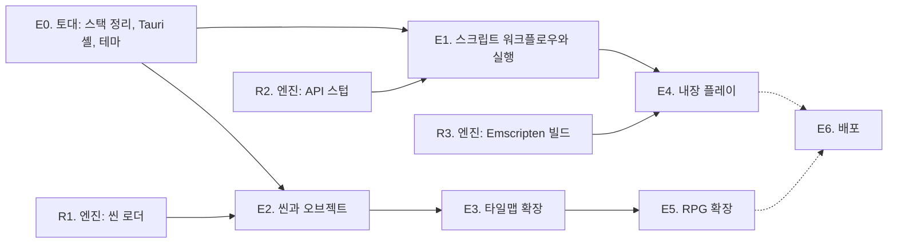

# InitialEditor 로드맵: 게임을 만드는 도구

> 작성일: 2026-09-26. 이 문서는 에디터 계획의 입구이며 진행 상황 추적표를 겸한다.
> 엔진 쪽 로드맵은 Initial2D 저장소의 `docs/plans/index.md`에 있고, 두 문서는 서로를 가리킨다.
> 작업을 시작하기 전에 이 문서의 진행 상황 표를 확인하고, 작업이 끝나면 반드시 갱신한다.

## 1. 한 문장

> **에디터에서 프로젝트를 열고, 씬에 오브젝트를 놓고, 스크립트를 쓰고, 실행 버튼을 누르면
> Initial2D에서 그 게임이 돈다.** 타일맵은 에디터가 기본으로 아는 것이 아니라
> 확장(플러그인)이 씬에 놓는 오브젝트의 한 종류다.

엔진의 원칙("이 기능이 플래피버드에도 말이 되는가")을 에디터에도 그대로 적용한다.
에디터 코어는 장르를 모르고, 타일맵과 RPG 이벤트는 확장이 더한다.

## 2. 결정 요약

저자의 요구 여섯 가지에 대한 답이다. 근거와 대안은 각 문서에 있다.

| 요구 | 결정 | 문서 |
|---|---|---|
| 기술 스택 검토 | **Tauri 2 데스크톱 셸 + TypeScript, React 18, PIXI 8, Monaco, dockview.** Electron은 제외한다 (저자 판정: 무겁다). 브라우저 + 브리지 서버 모드는 개발용으로 남긴다 | [01-tech-stack.md](01-tech-stack.md) |
| 어디까지, 어떤 장르 | **장르 중립 코어 + 확장.** 코어는 프로젝트, 자산, 씬과 오브젝트, 스크립트, 실행, 콘솔, 테마까지. 타일맵과 RPG(이벤트, 데이터베이스)는 확장 | [02-scope-and-screens.md](02-scope-and-screens.md) |
| 화면과 기능 | 도킹 패널: 계층, 프로젝트, 씬 뷰와 스크립트 탭, 인스펙터, 콘솔. 레이아웃은 저장되고 프리셋 셋(씬, 스크립트, 타일맵) | [02-scope-and-screens.md](02-scope-and-screens.md) |
| 로컬 파일과 크로스 플랫폼 | 프로젝트는 `game.json`이 있는 폴더. 파일 접근은 `ProjectBackend` 인터페이스 하나에 구현 둘(Tauri, 브리지). macOS 1순위, Windows 2순위, Linux 3순위 | [03-project-and-runtime.md](03-project-and-runtime.md) |
| 인게임 실행 | **두 모드.** 1차는 엔진 실행 파일을 프로젝트 폴더에서 띄우는 외부 프로세스(콘솔 연결, 저장 시 핫 리로드). 2차는 Emscripten으로 빌드한 엔진을 에디터 안 게임 뷰에 올리는 내장 실행 | [03-project-and-runtime.md](03-project-and-runtime.md), [e4-embedded-play.md](e4-embedded-play.md) |
| 웹 배포 (Cloudflare Pages) | **겸한다.** 같은 앱을 저장소의 Cloudflare Pages 로 계속 낸다. 브라우저판은 로컬 폴더를 브라우저의 폴더 열기(File System Access API, Chromium 계열)로 직접 열고, 게임은 엔진의 WASM 빌드(R3)로 페이지 안에서 돌린다. Tauri 앱은 엔진 프로세스 실행과 파일 감시가 되는 완전판이다. 둘은 `ProjectBackend` 구현만 다르다. 브리지 서버 모드는 개발용으로 남는다 (2026-09-26) | [e4-embedded-play.md](e4-embedded-play.md) |
| 테마 | CSS 변수 토큰 한 벌, `data-theme`로 다크와 라이트, 기본은 OS 설정. Monaco와 씬 뷰 배경도 토큰에서 | [02-scope-and-screens.md](02-scope-and-screens.md) 6절 |
| 타일맵은 확장으로 | 확장 API(`registerObjectType` 등)의 첫 소비자가 타일맵 확장. 옛 에디터의 타일맵 기능은 전부 그 확장으로 옮긴다 | [04-extensions-and-tilemap.md](04-extensions-and-tilemap.md) |

한 가지를 덧붙인다. **에디터가 만든 데이터가 게임에서 돌아가려면 엔진 쪽에 읽는 쪽이 있어야 한다.**
씬 파일(`resources/scenes/*.json`)을 읽어 오브젝트를 만드는 씬 로더는 C++이 아니라
스크립트 레이어(Lua와 Ruby)에 둔다. 엔진 저장소의 선행 작업이며 3절의 R1이다.

## 3. 현재 상태 (2026-09-26 조사)

### 에디터 (이 저장소)

| 항목 | 상태 |
|---|---|
| 구성 | yarn 1.22 워크스페이스 둘. `packages/initial-editor`(코어 클래스, PIXI 7.3.3, 2020년 DOM 셸)와 `packages/renderer`(React 18, Vite 6) |
| 규모 | TS와 TSX 12,601줄. 큰 파일은 `tilemap.ts` 1,052줄, `global-style.ts` 754줄, `app.ts` 650줄, `LuaEditor.tsx` 570줄 |
| 되는 것 | 4레이어 타일맵 그리기(펜, 사각형, 채우기), 타일셋 팔레트, 레이어 창, 브리지를 통한 스크립트 편집과 저장과 핫 리로드, 맵 열기와 저장과 내보내기(포맷 v1), 새 맵 |
| 안 되는 것 | 플레이 테스트(`alert` 스텁), 이벤트와 통행 편집, 맵 포맷 v2(열면 거부, 저장하면 `events` 유실), 오토타일(`AutoTile.ts`는 있으나 미사용), 오브젝트 개념 |
| 의존성 | 같은 역할이 두 벌씩이다. 번들러(webpack과 vite), DI(tsyringe와 typedi), 상태(mobx와 recoil), 스타일(styled-components와 tailwind), sass(dart-sass와 sass). babel과 jQuery 타입 잔재. `ElectronService`는 `@deprecated` |
| 테마 | CSS 변수 7개와 `conf/theme.json`, `ThemeManager`가 다크와 라이트를 바꾼다. 토큰이 너무 적어 패널이 늘면 못 버틴다 |
| 테스트 | `map-format.test.mjs` 하나(node --test), 픽스처 하나. 렌더링과 UI 테스트 없음 |
| 이력 | 2020년 Electron으로 시작, 2023년 웹으로 포팅(Electron 보일러플레이트 제거), 2025년 라이브러리 방식과 yarn classic 복귀, 2026-08 브리지 연동. `feature/initial2d-bridge`의 커밋 셋은 **아직 푸시되지 않았다** |

결론: **재작성에 가깝다.** 살릴 것은 순수 로직이다. `map/MapFormat.ts`(변환), `AutoTile.ts`(Wang blob),
`TilemapHistory.ts`(되돌리기), 채우기 알고리즘, `bridge/BridgeClient.ts`, 그리고 `LuaEditor.tsx`의
외부 변경 처리 정책(미수정이면 자동 재로드, 수정 중이면 배너). 셸과 렌더링과 메뉴 체계는 새로 짠다.

### 엔진 (Initial2D, 에디터가 기대는 것)

| 항목 | 상태 |
|---|---|
| 실행 제어 | 작업 폴더의 `./game.json`(창 크기, `renderScale`, `script`)과 환경 변수(`INITIAL2D_SCENE`, `INITIAL2D_SCRIPT`, `INITIAL2D_HMR`, `INITIAL2D_EXIT_AFTER`, `INITIAL2D_SCREENSHOT`, `INITIAL2D_WINDOW` 등). `Initial2D --features`로 지원 언어를 찍는다 |
| 핫 리로드 | TCP 5959, `I2DH` 프로토콜(파일 묶음을 보내면 스크립트 VM을 다시 시작) |
| 브리지 서버 | `tools/bridge/server.js`, HTTP 5960. `/api/project`, `/api/files/*`, `/api/reload`, WebSocket `/ws`(외부 변경 알림) |
| 데이터 | 맵 포맷 v2(`events` 배열), 커맨드 17종(스키마 파일은 계획만 있다), 씬 파일 없음 |
| 스크립트 | Lua 5.3(기본)과 mruby 4.0, 같은 API. `scripts/lua/`와 `scripts/ruby/` |
| 없는 것 | 씬 로더, API 스텁, Emscripten 빌드, 프로젝트 폴더를 인자로 받는 실행(지금은 작업 폴더가 곧 프로젝트) |

## 4. 단계 개요와 의존 관계

| 단계 | 문서 | 한 줄 요약 | 핵심 산출물 | 권장 모델 |
|---|---|---|---|---|
| E0 | [e0-foundation.md](e0-foundation.md) | 스택을 정리하고 Tauri 셸과 도킹 화면과 테마를 세운다 | `packages/core`, `packages/app`, `src-tauri/`, `ProjectBackend` 둘, 테마 토큰 | **Fable 5** |
| E1 | [e1-scripting.md](e1-scripting.md) | 스크립트를 쓰고 저장하면 게임이 다시 뜨고, 실행 버튼으로 게임을 띄운다 | Monaco 에디터, API 자동완성, 외부 프로세스 실행과 콘솔 | Opus 5 |
| E2 | [e2-scene.md](e2-scene.md) | 씬에 오브젝트를 놓고 저장하면 게임이 그 씬을 연다 | 씬 포맷 v1, 계층과 인스펙터와 씬 뷰, 되돌리기, 스크립트 컴포넌트 | **Fable 5** |
| E3 | [e3-tilemap.md](e3-tilemap.md) | 게임의 맵을 연다: 실제 타일셋으로 칠하고, 통행을 칠하고, 몬스터와 흔적 같은 배치를 맵 위에서 옮기고, 그 자리에서 실행한다 | 맵 모델(`ext-tilemap/model`), 맵 뷰(PIXI), 팔레트와 레이어 패널, 오브젝트 레이어와 스키마 폼, 여기서 실행. 엔진 짝은 알데바란 배치의 맵 이전(M1) | **Fable 5** |
| E4 | [e4-embedded-play.md](e4-embedded-play.md) | 게임이 에디터 안에서 돌고, 같은 앱이 웹(Cloudflare Pages)에서도 쓸모 있다 | 게임 뷰 패널, WASM 엔진 로더, 브라우저 폴더 열기 백엔드 | **Fable 5** |
| E5 | (구상, 5절) | RPG 확장: 이벤트 배치와 커맨드 편집, 데이터베이스 | 엔진의 `docs/plans/12-editor-events.md` 마일스톤 2와 3 | **Fable 5** |
| E6 | (구상, 5절) | Windows와 Linux 빌드, 설치 파일, 안드로이드 에셋 스테이징 | 배포 패키지 | Opus 5 |
| R1 | Initial2D `docs/plans/index.md` 에디터 트랙 | 엔진: 씬 로더 (Lua와 Ruby, `scripts/*/scene_loader`) | 씬 포맷 v1 픽스처, 로더, 새 프로젝트 템플릿 | **Fable 5** |
| R2 | 위와 같음 | 엔진: API 스텁과 대조 테스트 | `resources/api/initial2d.lua`(주석 기반 타입), Ruby 스텁, 표면 대조 테스트 | Opus 5 |
| R3 | 위와 같음 | 엔진: Emscripten 빌드 | `build-web/`, CMake의 EMSCRIPTEN 분기, 핫 리로드 서버 제외 | **Fable 5** |

모델 선정 기준은 엔진 로드맵과 같다. 최소 기준선은 Opus 5, 뒤 단계의 토대가 되는 설계(E0의 패키지 경계와 백엔드 계약,
E2의 씬 포맷, E4의 파일 스테이징)는 Fable 5.

순서에 대한 메모: E1과 E2는 E0 뒤에 병행할 수 있다. E1이 먼저인 이유는 저자가 "이 에디터에서 가장 중요한 건
스크립트 작성"이라고 했기 때문이며, E1은 R1 없이 완성된다. E3은 E2의 확장 API가 있어야 시작한다.

## 5. 이후 후보 (E5, E6과 그 다음)

여기부터는 순서가 아니라 후보다. 만들려는 게임이 요구하는 것이 다음이 된다.

| 후보 | 언제 필요해지는가 | 어디에 붙는가 | 크기 |
|---|---|---|---|
| E5. RPG 확장 | 알데바란이 아니라 항구 마을 같은 RPG를 에디터로 만들 때. 엔진의 `12-editor-events.md`가 이미 마일스톤 넷을 적어 두었다 (마일스톤 1 "잃지 않기"는 E3에서 먼저 한다) | `packages/ext-rpg`: 이벤트 오브젝트 타입, 스키마 기반 커맨드 폼, 데이터베이스 패널 | 대 |
| E6. 배포 | 다른 사람이 설치해서 쓸 때 | Tauri 번들(dmg, msi, AppImage), 엔진 사이드카, 안드로이드 `prepare_assets.sh` 버튼 | 중 |
| 오토타일 | 맵을 손으로 그릴 때. 엔진 `roadmap-v2.md` 13단계의 "굽기" 방식 | 타일맵 확장 | 중 |
| 애니메이션 편집기 | 시트 프레임 구간을 눈으로 정할 때 | 코어 자산 검사기 | 소 |
| 써드파티 확장 동적 로딩 | 확장이 다섯을 넘고 저장소 밖에서 만들 때 | 확장 호스트 | 중 |
| 언어 서버(LSP) | 자동완성 스텁으로 부족할 때 | Monaco + 사이드카 | 중 |

## 6. 하지 않기로 한 것

- **Electron.** 저자 판정(2026-09-26)이 "너무 무겁다". 대안은 01 문서.
- **에디터 자체의 스크립트 언어나 비주얼 스크립팅.** 언어는 엔진이 이미 둘(Lua, Ruby) 가지고 있고, 이벤트는 커맨드 목록이 그 자리를 채운다.
- **에디터가 렌더링 규칙을 다시 구현하는 것.** 씬 뷰는 편집용 근사이고, 진짜 화면은 게임 뷰(실행)가 보여 준다. Unity의 Scene과 Game이 다른 것과 같다.
- **RPG 개념의 코어 진입.** 이벤트, 대화창, 데이터베이스는 확장이다. 코어에 `npc`가 생기는 순간 플래피버드가 못 쓰는 에디터가 된다.
- **협업, 클라우드, 계정.** 로컬 폴더가 프로젝트다.

## 7. 진행 상황

> 상태: ⬜ 대기, 🟡 진행 중, ✅ 완료. 각 단계 문서 안의 체크리스트를 먼저 갱신한 뒤, 이 표의 상태와 메모를 함께 갱신한다.

| 단계 | 상태 | 마지막 갱신 | 메모 |
|---|---|---|---|
| E0. 토대 | ✅ 완료 | 2026-09-26 | 완료 기준 6개 충족 (Tauri 창의 폴더 선택과 화면은 저자 확인 필요). 워크스페이스를 `core`, `backend-bridge`, `backend-tauri`, `app`, `ext-tilemap`, `src-tauri` 로 재편하고 옛 패키지는 `legacy/`(테스트 23건과 빌드 그대로). 코어(백엔드 계약, 경로, 문서와 되돌리기, 커맨드와 단축키, 메뉴, 확장 API, 프로젝트, 로그, 설정, UTF-8) 단위 48건. 브리지 백엔드는 엔진 브리지 0.2.0(PR #38: 폴더 API, `game.json`, `.rb` 리로드, 변경 종류)에 기대며 적합성 14건이 메모리와 브리지 양쪽 통과. Rust 셸은 명령 18개(표 + `project_close`, `startup_open_path`), `cargo test` 38건(원자 쓰기 경쟁, 심링크 탈출, I2DH 픽스처가 엔진 인코더와 바이트 일치, notify 감시의 self/external). React 셸은 dockview 패널 여섯과 프리셋 셋, HTML 메뉴 바와 Tauri 네이티브 메뉴가 같은 커맨드 레지스트리에서, 프로젝트 트리와 콘솔과 상태 바와 토스트와 모달, 미리보기 문서 셋, 테마 토큰과 색 리터럴 검사. 검수: 타입과 린트, Vitest 69건, Playwright 6건(메모리 5, 브리지 1), `yarn tauri build --debug` 로 .app 과 .dmg, 빌드한 앱이 임시 프로젝트를 열어 레이아웃 파일을 쓰는 것까지. **배운 것** 은 e0 문서 구현 노트 (Yarn 은 Berry, Vitest 하나, `TextEncoder` 대신 UTF-8 코덱, 절대 경로 거부, Tailwind 제외, Berry 의 `yarn workspace <옛 패키지> run` 문제). **남은 것**: Windows 와 Linux 는 E1 과 E6 에서, CI 의 GitHub 첫 실행은 PR 에서 본다 |
| E1. 스크립트 워크플로우와 실행 | ✅ 완료 | 2026-09-26 | 완료 기준 중 Windows 를 뺀 다섯 충족 (Windows 는 저자 실기). **편집기**: Monaco 문서(lua, rb, json, txt, md, csv, fnt), 저장은 LF, dirty 는 버전 비교, 외부 변경은 미수정이면 재로드하고 수정 중이면 배너, 탭 오갈 때 커서 유지, 테마 토큰으로 Monaco 테마, 설정(글꼴, 탭, 줄바꿈, 미니맵). **자동완성**: 엔진 R2 의 `resources/api/initial2d-api.json` 을 읽어 Lua 전역과 모듈 멤버, Ruby 모듈 메서드와 `Keys::` 와 `:symbol`, 시그니처 도움말과 호버, 씬 계약 스니펫. **찾기**: 편집기 안(Ctrl+F)과 프로젝트 전체(Ctrl+Shift+F, 대소문자와 정규식). **새 스크립트**(Ctrl+Alt+N, 씬과 컴포넌트 템플릿). **실행기**: 엔진 경로 탐색 넷(설정, `.initial-editor/engine`, `build/Initial2D`, 형제 저장소)을 `--features` 로 찔러 확인, F5/Shift+F5/다시 시작, mruby 없는 빌드 거부, 출력을 콘솔에 링크로(Lua, Ruby 백트레이스, Windows 경로), 상태 바에 PID 와 경과, 저장 시 핫 리로드(Tauri 는 파일을 모아 보내고 브리지는 서버가 모은다). **엔진 수정**(PR #39): Lua 오류를 pcall 로 보고하고 종료 코드 1, 파이프 stdout 줄 버퍼링. 검수: Vitest 187, Playwright 19(메모리 18, 브리지 1), 진짜 엔진 핫 리로드 교차 검사(`yarn test:engine`), 타입과 린트와 색 검사 통과 |
| E2. 씬과 오브젝트 | ✅ 완료 | 2026-09-26 | 완료 기준 6개 충족. **코어**: 씬 포맷 v1 파서와 직렬화(모르는 키 보존, 키 순서 고정), 의미 검사(엔진 로더와 같은 목록), 명령 객체(추가, 삭제, 이동 합치기, 속성, 이름, 순서, 스크립트), 씬 문서와 선택. **씬 뷰**(PIXI 8): 격자와 스냅과 줌과 팬, 카메라 사각형, 클릭과 상자 선택, 끌기(되돌리기 한 단계), 방향키, 테마 색, 이미지 캐시, 확장 타입은 `createSceneNode`. **씬 도구**: 계층(순서 끌기, 눈, 이름 바꾸기, 컨텍스트 메뉴), 인스펙터(공통 칸, 스프라이트와 글자 인스펙터, 스크립트 붙이기와 만들기, 검사 결과), 새 씬과 오브젝트 추가와 시작 씬 지정과 복사와 붙여넣기, `run.fromScene`(Ctrl+F5). **템플릿**: 엔진의 씬 로더와 진입 파일과 플래피 씬을 `yarn sync:templates` 로 복사(MANIFEST sha256)해 새 프로젝트(빈, 플래피, Lua 와 Ruby)를 만든다. 검수: Vitest 235+, Playwright 8(씬 뷰 3, 씬 도구 3, 스모크), `yarn test:engine-scene` 26건(템플릿 둘 x 언어 둘을 진짜 엔진이 돌린다), 엔진 쪽 R1 씬 테스트 442 PASS. 엔진 짝은 Initial2D R1(PR #41, #42) |
| E3. 맵 편집 | 🟡 진행 중 | 2026-09-26 | **방향을 바꿨다** (2026-09-26 저자 판정: "단순 스크립트 에디터로는 아무것도 할 수 없다"). 옛 에디터 기능의 이전보다 **알데바란 맵을 실제로 고치는 일**을 먼저 한다: 숲과 무덤 맵을 실제 타일셋으로 칠하고, 통행을 칠하고, 몬스터와 순찰 범위와 흔적과 구간을 맵 위에서 옮기고, 그 자리에서 실행한다. 엔진은 배치를 스테이지 스크립트에서 맵 파일의 `objects` 로 옮겨 Lua 와 Ruby 가 한 벌을 읽는다. 맵 모델은 완료(단위 20건, 엔진의 실제 맵 다섯 장 왕복) |
| E4. 내장 플레이와 웹판 | ✅ 완료 | 2026-09-27 | 완료 기준 다섯 충족. **게임 뷰**: 엔진의 WASM 빌드(R3, `yarn sync:engine-web` 으로 `public/engine/` 에 사본과 MANIFEST)를 문서 탭 "게임"의 canvas 에 올린다. 파일은 백엔드로 읽어 MEMFS 에 올리고(동시 8개), 저장하면 바뀐 파일만 다시 올려 `reload()`. 탭은 문서 영역 오른쪽 새 그룹에 열리고 옮긴 자리를 기억한다. 실행 단축키는 스크립트 편집기와 canvas 안에서도 에디터가 받는다. 오류는 네이티브와 같다 (같은 줄과 링크, 시작과 Update 의 오류는 종료 코드 1, 저장한 스크립트의 오류는 스크립트만 멈추고 고쳐 저장하면 다시 그린다, 엔진 밖 예외는 `fatal:` 과 종료 코드 1). mruby 가 든 웹 빌드면 Ruby 게임도 돈다 (마일스톤 6). Ruby 의 C 를 거치는 끝없는 재귀는 `SystemStackError`, 바인딩 안의 C++ 예외는 `rescue` 로 잡히는 `RuntimeError` 이고 잡지 않으면 네이티브와 같은 줄 묶음과 종료 코드 1 (엔진 470074b, e2e 가 네이티브의 줄과 견준다). 알데바란이 헤드리스 크로미움 게임 탭에서 60 FPS. **같은 화면**: 인수 씬의 타이틀 20 프레임을 네이티브(헤드리스)와 게임 탭에서 견주면 다른 픽셀 0% 나 1.44% (허용 2%, 엔진 골든 규칙), 차이는 메뉴 커서의 깜빡임 위상뿐 (e2e). **웹판**: 브라우저 폴더 백엔드(`packages/backend-fsaccess`, File System Access API, 폴링 감시), 일반 창이라고 확신할 때만(JS 힙 한도를 알고 저장 할당량이 그 두 배와 4 GiB 보다 크다) 기억한 핸들을 꺼내고 나머지는 폴더 고르기로 (시크릿 창에서 꺼내면 브라우저가 통째로 죽는다). Ctrl+O 는 샘플 뒤에도 폴더 고르기이고, 저장하지 않은 문서를 묻는 곳에서 취소하면 기억한 폴더도 열린 프로젝트도 그대로다. 뜨는 중에 모은 저장은 엔진이 첫 프레임을 돈 뒤에 올리고(그 전에 끝나면 버리고 한 줄), 밖의 엔진으로 보낼지는 백엔드가 정하며(메모리 백엔드는 늘 보내지 않는다), 꺼져 있는 리로드의 단축키도 브라우저의 새로 고침으로 가지 않고, 메모리 프로젝트에 저장한 것이 있으면 떠나기 전에 묻는다. Ruby 예외를 C를 거친 깊은 재귀 너머에서 `rescue`하는 비용(크롬에서 수십 ms)은 WebAssembly 예외 처리의 알려진 한계로 적었다. 검수: Vitest 577, Playwright 62(게임 뷰 22, 웹 폴더 8 포함), 타입과 린트와 색 검사. **남은 것**(완료 기준 밖): 큰 파일의 요청 시 읽기, 엔진 README 의 실행 링크(배포는 저자 결정), 진짜 로컬 폴더로 시크릿 창의 폴더 고르기 확인(저자), 엔진 브랜치 `fix/wasm-lua-errors` 를 master 에 합친 뒤 다시 동기화 |
| R1. 엔진 씬 로더 | ⬜ 대기 | 2026-09-26 | 엔진 저장소 작업. C++ 무수정 목표 |
| R2. 엔진 API 스텁 | ⬜ 대기 | 2026-09-26 | 손으로 유지하고 표면 테스트가 대조한다 (커맨드 스키마와 같은 방식) |
| R3. 엔진 Emscripten 빌드 | ⬜ 대기 | 2026-09-26 | emcc 미설치. 웹 데모가 부산물이다 |

### 갱신 규칙

1. 어떤 단계의 작업을 시작하면 상태를 🟡로 바꾸고 날짜를 갱신한다.
2. 작업 단위가 끝날 때마다 해당 단계 문서의 체크리스트(`- [ ]` → `- [x]`)를 갱신한다. 구현은 엔진과 같은 자율 검증 루프로 한다. 스스로 빌드하고 테스트를 돌려 통과할 때까지 반복하고, 테스트를 약화시켜 통과시키지 않으며, 같은 실패가 세 번 반복되면 멈추고 보고한다.
3. 단계의 완료 기준을 전부 만족해야 ✅로 바꾼다. 완료 기준에는 늘 "에디터가 만든 것을 엔진이 실제로 돌린다"는 교차 검증이 하나 들어 있다.
4. 계획이 현실과 어긋나면 계획 문서를 고친다. 문서는 계약이 아니라 지도다.
5. 새 도구나 워크플로우를 만들면 사용법을 이 저장소와 엔진 저장소의 README에 함께 적는다.
